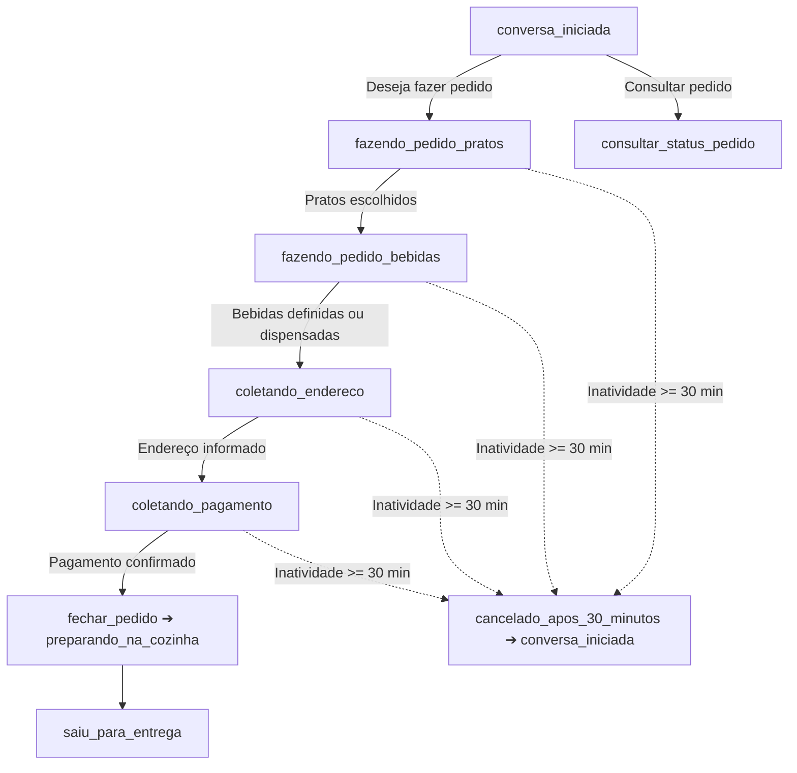

# ANDAMENTO.md · Contexto Consolidado do Projeto

> **📌 REGRA PARA A IA:** Leia este documento no início de qualquer nova sessão para absorver todo o contexto do projeto de forma instantânea e com economia máxima de tokens.

---

## 1. 🏢 Negócio e Identidade
* **Empresa:** Restaurante Família Ricardo (desde 2018).
* **Segmento:** Refeições caseiras, pratos executivos, pratos do dia, porções e bebidas.
* **Canal de Vendas:** Delivery e atendimento automático via WhatsApp oficial (Meta Cloud API).
* **Endereço:** Av. Irineu Mendes de Souza, 1531, Martim de Sá - Caraguatatuba/SP.
* **Horário:** Segunda a sábado, das 11:00 às 14:30. Domingo fechado.
* **Contatos:** (12) 99750-0045 / (12) 98146-4976.

---

## 2. 🍽️ Cardápio & Tabela de Preços (`negocio.md`)

| Categoria | Item | Tamanho(s) | Preço (R$) |
| :--- | :--- | :--- | :--- |
| **Pratos Diários** | Filé de Frango Acebolado | Infantil / Grande | R$ 25,00 / R$ 30,00 |
| | Filé de Frango à Parmegiana | Grande | R$ 30,00 |
| | Filé de Frango à Milanesa | Grande | R$ 30,00 |
| | Calabresa Acebolada | Infantil / Médio / Grande | R$ 20,00 / R$ 25,00 / R$ 30,00 |
| | Calabresa com Queijo | Infantil / Médio / Grande | R$ 25,00 / R$ 25,00 / R$ 30,00 |
| | Bife em Tiras Acebolado | Infantil / Médio / Grande | R$ 25,00 / R$ 25,00 / R$ 35,00 |
| | Bife em Tiras com Queijo | Infantil / Médio / Grande | R$ 25,00 / R$ 25,00 / R$ 35,00 |
| | Omelete | Infantil / Médio / Grande | R$ 25,00 / R$ 25,00 / R$ 28,00 |
| **Prato do Dia** | Feijoada Tradicional | Quarta e Sábado | Conforme tabela do dia |
| | Pratos Variados | Seg, Ter, Qui, Sex | Conforme tabela do dia |
| **Porções** | Batata Frita | Pequena / Média | R$ 15,00 / R$ 23,00 |
| | Batata com Queijo | Pequena / Média | R$ 18,00 / R$ 28,00 |
| | Feijão Carioca | Pequena / Média | R$ 15,00 / R$ 25,00 |
| | Arroz Branco | Porção | Consultar |
| **Adicionais** | Farofa / Mix Legumes Refogados / Ovo | Porção | R$ 7,00 / R$ 7,00 / R$ 2,00 |
| **Cervejas** | Skol (350ml) / Budweiser LN / Heineken LN | Unidade | R$ 8,00 / R$ 12,00 / R$ 12,00 |
| **Bebidas** | Água / Refri Lata / Tubaína 600ml / Suco Del Valle / Limoneto | Unidade | R$ 5,00 / R$ 8,00 / R$ 8,00 / R$ 10,00 / R$ 10,00 |
| | Refrigerante 2L / Coca-Cola 2L | Garrafa | R$ 14,00 / R$ 20,00 |

---

## 3. 🤖 Fluxo de Atendimento do Robô & Máquina de Estados da Conversa

### Estados Conversacionais (`STATUS_CONVERSA`):
1. `conversa_iniciada`: Cliente iniciou contato ou saudação ("oi", "olá"). O bot verifica se deseja fazer pedido ou consultar status.
2. `fazendo_pedido_pratos`: O cliente escolhe os pratos principais, porções e tamanhos (Infantil, Médio, Grande).
3. `fazendo_pedido_bebidas`: Pratos definidos. O bot apresenta e coleta as bebidas (Refrigerantes, Sucos, Água, Cervejas) ou confirma se dispensa.
4. `coletando_endereco`: Pratos e bebidas definidos. O bot solicita os dados de entrega (Rua, Número, Bairro, CEP/Ponto de Referência e Nome).
5. `coletando_pagamento`: Endereço informado. O bot solicita a forma de pagamento (Cartão de Crédito, Débito, Pix ou Dinheiro) e troco se aplicável.
6. `preparando_na_cozinha`: Pedido fechado com sucesso (`fechar_pedido`), comanda gerada e pedido em produção.
7. `saiu_para_entrega`: Pedido despachado para entrega com motoboy.
8. `cancelado_apos_30_minutos`: Inatividade superior a 30 minutos em pedidos em andamento cancela o rascunho e reinicia o fluxo.

> ⏱️ **Regra de Continuidade e Limite de 30 Minutos:**
> - **Antes de 30 minutos de inatividade:** Ao receber nova mensagem, o bot verifica o status atual do cliente e continua exatamente do ponto em que parou (se estava escolhendo pratos continua nos pratos; se estava nas bebidas continua nas bebidas; se estava no endereço continua no endereço; se estava no pagamento continua no pagamento).
> - **Após 30 minutos de inatividade sem fechar o pedido:** O status é resetado para `conversa_iniciada`, limpando o rascunho temporário.

---

## 4. 🗂️ Estrutura e Papel dos Arquivos

### 🚀 Backend API (Laravel 13 / PHP 8.5) — `backend/`
* [backend/routes/api.php](file:///c:/@PROJETOS/APP/restaurante-ricardo-whatsapp/backend/routes/api.php): Endpoints REST para Dashboard, Pedidos, Clientes, Cardápio e Atendimentos.
* [backend/app/Http/Controllers/DashboardController.php](file:///c:/@PROJETOS/APP/restaurante-ricardo-whatsapp/backend/app/Http/Controllers/DashboardController.php): KPIs em tempo real, gráfico de vendas, top produtos, mapa de bairros e métricas de IA.
* [backend/app/Http/Controllers/PedidoController.php](file:///c:/@PROJETOS/APP/restaurante-ricardo-whatsapp/backend/app/Http/Controllers/PedidoController.php): Gestão e avanço de status dos pedidos da cozinha.
* [backend/app/Models/](file:///c:/@PROJETOS/APP/restaurante-ricardo-whatsapp/backend/app/Models/): 10 Models Eloquent com relacionamentos (Cliente, Pedido, Endereco, Categoria, Produto, Atendimento, etc.).
* [backend/database/migrations/](file:///c:/@PROJETOS/APP/restaurante-ricardo-whatsapp/backend/database/migrations/): Migrations relacionais completas para MySQL 8.0+.
* [backend/database/seeders/](file:///c:/@PROJETOS/APP/restaurante-ricardo-whatsapp/backend/database/seeders/): Cardápio oficial e mock de dados realistas para o Dashboard.

### 🎨 Frontend Dashboard (Angular 22 / Standalone / Signals) — `frontend/`
* [frontend/src/app/pages/dashboard/](file:///c:/@PROJETOS/APP/restaurante-ricardo-whatsapp/frontend/src/app/pages/dashboard/): Painel executivo com cards KPI, gráficos Chart.js (vendas diárias e pagamentos), funil de pedidos e curva ABC de produtos.
* [frontend/src/app/pages/pedidos/](file:///c:/@PROJETOS/APP/restaurante-ricardo-whatsapp/frontend/src/app/pages/pedidos/): Quadro operacional da cozinha com transição de status (Pendente -> Em Preparo -> Em Rota -> Entregue).
* [frontend/src/app/pages/clientes/](file:///c:/@PROJETOS/APP/restaurante-ricardo-whatsapp/frontend/src/app/pages/clientes/): Tabela com LTV (Lifetime Value), recorrência e link direto para conversa no WhatsApp.
* [frontend/src/app/pages/cardapio/](file:///c:/@PROJETOS/APP/restaurante-ricardo-whatsapp/frontend/src/app/pages/cardapio/): Gestão de pratos e toggle instantâneo de disponibilidade no robô.
* [frontend/src/app/pages/atendimentos/](file:///c:/@PROJETOS/APP/restaurante-ricardo-whatsapp/frontend/src/app/pages/atendimentos/): Monitoramento de conversas da IA e alertas de transbordo humano.

### 🤖 Bot WhatsApp & Banco
* [database/schema.sql](file:///c:/@PROJETOS/APP/restaurante-ricardo-whatsapp/database/schema.sql): Referência da estrutura (25 tabelas), gerada das migrations por `php artisan botclient:exportar-schema`; o banco real é criado por `php artisan migrate`. `SchemaReferenciaTest` falha se faltar tabela.
* [database/seeds.sql](file:///c:/@PROJETOS/APP/restaurante-ricardo-whatsapp/database/seeds.sql): Carga inicial oficial com categorias, produtos e variações de preços do restaurante.
* [database/views.sql](file:///c:/@PROJETOS/APP/restaurante-ricardo-whatsapp/database/views.sql): Views analíticas opcionais (BI); o painel não usa. Conferidas com as colunas atuais, data no fuso -03:00.
* [README.md](file:///c:/@PROJETOS/APP/restaurante-ricardo-whatsapp/README.md): Documentação completa do projeto, fluxo de atendimento, setup e comandos.
* [.gitignore](file:///c:/@PROJETOS/APP/restaurante-ricardo-whatsapp/.gitignore): Proteção de credenciais (.env), logs e arquivos de runtime.
* [negocio.md](file:///c:/@PROJETOS/APP/restaurante-ricardo-whatsapp/negocio.md): Ficha de verdade do restaurante (cardápio, regras, horários, endereço).
* [cerebro.js](file:///c:/@PROJETOS/APP/restaurante-ricardo-whatsapp/cerebro.js):
  - Memória local persistida ([memoria.json](file:///c:/@PROJETOS/APP/restaurante-ricardo-whatsapp/memoria.json), janela de 30 min por inatividade).
  - Chamada à API OpenRouter com `google/gemini-3.7-flash` e `max_tokens: 450`.
  - Tratamento resiliente e amigável para erros de API (402/429/limite de créditos com direcionamento para telefone da loja).
  - Serialização de concorrência por telefone (`responderNaFila`).
  - Máquina de estados conversacional (`STATUS_CONVERSA`) com ferramentas: `atualizar_status_conversa`, `fechar_pedido`, `consultar_status_pedido`, `chamar_atendente` e estado explícito `STATUS_CONVERSA.TRANSBORDO` (`transbordo_humano`).
  - **Saudação Contextual & Menu Numerado:** Identificação automática de pedido ativo recente (últimas 12h) e opções numeradas intuitivas (1️⃣ Fazer pedido, 2️⃣ Acompanhar pedido, 3️⃣ Falar com a equipe).
  - **Envio Direto da Tabela de Pedidos:** Ao fechar o pedido ou consultar o status, a resposta enviada ao cliente é consultada diretamente da tabela e formatada de forma determinística, sem deixar a geração do comprovante para a IA.
* [pedidos.js](file:///c:/@PROJETOS/APP/restaurante-ricardo-whatsapp/pedidos.js):
  - Banco de pedidos persistido ([pedidos.json](file:///c:/@PROJETOS/APP/restaurante-ricardo-whatsapp/pedidos.json)) e sincronização REST com API Laravel/MySQL.
  - Funções de busca direta na tabela: `obterPedidoPorId` e `obterUltimoPedidoPorTelefone`.
  - Geração de IDs com data completa (`PED-AAMMDD-XXX`, ex: `PED-261004-742`), sorteio criptográfico e sem repetir códigos já usados.
  - Formatação e impressão térmica da comanda da cozinha (`formatarComanda`, `imprimirComanda`).
  - Geração de mensagem oficial formatada para o cliente (`formatarMensagemConfirmacaoCliente` e `formatarMensagemStatusCliente`).
* [agente.js](file:///c:/@PROJETOS/APP/restaurante-ricardo-whatsapp/agente.js):
  - Servidor HTTP Node.js sem dependências para o webhook da Meta (`/webhook`).
  - Validação de assinatura HMAC-SHA256 (`x-hub-signature-256`) e deduplicação de mensagens.
* [simular.js](file:///c:/@PROJETOS/APP/restaurante-ricardo-whatsapp/simular.js):
  - Interface CLI interativa para simular atendimentos e pedidos via terminal (`npm run simular`).
* [testar.js](file:///c:/@PROJETOS/APP/restaurante-ricardo-whatsapp/testar.js):
  - Bateria de testes automatizados (`npm run testar`).
* [.env](file:///c:/@PROJETOS/APP/restaurante-ricardo-whatsapp/.env):
  - Chaves de acesso da Meta, OpenRouter e credenciais MySQL.

---

## 5. 🗄️ Arquitetura de Banco de Dados (`agente-watsapp`)
* **SGBD:** MySQL 8.0+
* **Tabelas Operacionais:** `clientes`, `enderecos`, `categorias`, `produtos`, `produto_variacoes`, `pedidos`, `pedido_itens`, `pedido_item_adicionais`.
* **Tabelas Analíticas (Dashboard):** `atendimentos` (TMA, taxa de conversão do bot, transbordo) e `historico_status_pedidos` (lead time / tempo de preparo e entrega).
* **Views Analíticas:** `v_dashboard_kpis_gerais`, `v_dashboard_vendas_por_dia`, `v_dashboard_ranking_produtos`, `v_dashboard_mapa_bairros`, `v_dashboard_formas_pagamento`, `v_dashboard_metricas_ia_atendimento`.

---

## 6. ⚙️ Comandos Úteis
* **API Laravel (Backend):** `npm run start:api` ou `cd backend && php artisan serve`
* **Dashboard Angular (Frontend):** `npm run start:front` ou `cd frontend && npm start`
* **Robô WhatsApp:** `npm run start:bot` ou `npm start`
* **Testes Automatizados:** `npm run testar`
* **Simulador no Terminal:** `npm run simular`

---

## 7. 🧩 Regras e Perfis de Engenharia Instalados (`.agents/rules/`)
* [clean-architecture.md](file:///c:/@PROJETOS/APP/restaurante-ricardo-whatsapp/.agents/rules/clean-architecture.md): Princípios SOLID, divisão de camadas (Domínio, Casos de Uso, Adaptadores, Infra) e código limpo.
* [web-design-system.md](file:///c:/@PROJETOS/APP/restaurante-ricardo-whatsapp/.agents/rules/web-design-system.md): Padrões de UI/UX, Design System, micro-animações, responsividade e tipografia.
* [nodejs-patterns.md](file:///c:/@PROJETOS/APP/restaurante-ricardo-whatsapp/.agents/rules/nodejs-patterns.md): Segurança de webhooks, resiliência de filas assíncronas e observabilidade.
* [andamento.md](file:///c:/@PROJETOS/APP/restaurante-ricardo-whatsapp/.agents/rules/andamento.md): Leitura e atualização contínua do histórico do projeto.

---

## 8. 📋 Lista de To-Do (Implementações)

- [x] **1. Visão de Lista e Cards no Frontend (Angular):**
  - Implementada alternância dinâmica (toggle switch) na tela de pedidos entre:
    - **Visão em Cards (Kanban / Grid):** Visual ágil para acompanhamento rápido de status na cozinha/expedição.
    - **Visão em Lista (Tabela com filtros):** Visual denso com colunas detalhadas (código, data/hora, cliente/WhatsApp, endereço/bairro, itens, pagamento/troco, valor total, status e ações rápidas).

- [x] **2. Automação de Notificação de Saída para Entrega (WhatsApp):**
  - Ao funcionário clicar em **"🛵 Despachar (Notificar Cliente)"** no painel/dashboard:
    - Notificação disparada automaticamente no WhatsApp com toast visual no dashboard:
      > *"🛵💨 Temos uma ótima notícia! O seu pedido [Nº PEDIDO] acabou de sair para entrega e já está a caminho!"*
    - Atualização simultânea das tabelas `pedidos`, `historico_status_pedidos` e `status_conversas` para o status `saiu_para_entrega`.

- [x] **3. Cardápio Dinâmico da Tabela de Produtos & CRUD Completo de Pratos:**
  - **Injeção Dinâmica na IA:** O bot WhatsApp (`cerebro.js` via `GET /api/cardapio/texto`) obtém os pratos, porções, bebidas e preços diretamente das tabelas relacionais `produtos` e `produto_variacoes` filtrando apenas registros com `ativo = 1`.
  - **CRUD de Pratos no Backend (Laravel):**
    - `GET /api/cardapio`: Lista todos os pratos com categorias e variações de tamanho/preço.
    - `GET /api/cardapio/categorias`: Categorias disponíveis para cadastro.
    - `GET /api/cardapio/texto`: Texto oficial formatado para o prompt do bot.
    - `POST /api/cardapio`: Criação de novo prato com variações dinâmicas de preços.
    - `PUT /api/cardapio/{id}`: Edição completa de nome, categoria, descrição, ativo e variações.
    - `DELETE /api/cardapio/{id}`: Exclusão com cascata de variações.
    - `PATCH /api/cardapio/{id}/toggle-status`: Alternância instantânea de Ativo / Pausado no WhatsApp.
  - **CRUD de Pratos no Frontend (Angular):**
    - Modal interativo para adicionar novo prato ou editar prato existente.
    - Gestão inline de múltiplas variações de tamanho (Infantil, Médio, Grande, etc.) e valores em R$.
    - Toggle visual e ágil de "Ativo / Pausado" por card e tabela.
    - Filtros por categoria e busca textual em tempo real.

- [x] **4. Visão em Lista e Cards no Monitor de Atendimentos IA (Angular):**
  - Implementado alternador de visualização (`modoVisao`: Cards vs Lista) na tela [atendimentos.component.ts](file:///c:/@PROJETOS/APP/restaurante-ricardo-whatsapp/frontend/src/app/pages/atendimentos/atendimentos.component.ts).
  - **Visão em Lista:** Tabela com Telefone/Avatar, data/hora do último contato, badge de estágio da IA, tags inline do rascunho (pratos, bebidas, endereço e pagamento), horário de expiração de 30 minutos e botão de ação rápida para abertura da conversa no WhatsApp.

- [x] **5. Homologação Oficial de Webhook & Atendimento via WhatsApp Real:**
  - Configuração do túnel Cloudflare (`trycloudflare.com`) e integração bidirecional com a Meta WhatsApp Cloud API.
  - Correção de payloads de mensagens, aumento de tokens contextuais para 1500 tokens e validação de sessão em tempo real com o celular do cliente.

- [x] **6. Status de Digitando & Idempotência no Despacho de Pedidos:**
  - **Status de Digitando / Lida:** O robô marca imediatamente a mensagem recebida como lida na Meta Cloud API para dar feedback visual instantâneo ao cliente de que a mensagem está sendo processada.
  - **Idempotência no Despacho (3 Camadas):**
    - *Frontend (Angular):* Botão "Despachar" desabilita imediatamente ao ser clicado, exibindo `⏳ Despachando & Notificando...` e impedindo múltiplos cliques acidentais tanto em Cards quanto na Lista.
    - *Backend (Laravel):* Só dispara notificação de saída para o WhatsApp se o status anterior for estritamente diferente de `saiu_para_entrega`, enviando `idempotency_key` única.
    - *Agente Webhook (Node.js):* Endpoint `/api/notificar` deduplica e bloqueia mensagens repetidas com a mesma chave dentro de uma janela de 10 minutos.

- [x] **7. Reset do Status do Cliente pós-Fechamento de Pedido:**
  - Ao concluir a ferramenta `fechar_pedido`, o pedido é salvo com status `pendente`/`em_preparo` e o estado conversacional do cliente volta imediatamente para `conversa_iniciada` (`STATUS_CONVERSA.INICIADA`), limpando o rascunho de compra e armazenando `ultimoPedidoId`.
  - Sincronização em tempo real na memória local e na tabela `status_conversas` do MySQL, deixando o cliente apto para nova interação ou consulta de status.

- [x] **8. Tabela de Status de Pedidos (`status_pedidos`):**
  - Criação da tabela mestre de catálogo de status no MySQL: `status_pedidos` com campos `id`, `codigo`, `nome`, `descricao`, `cor_badge`, `icone`, `ordem`, `ativo`, `created_at`, `updated_at`.
  - Migration executada e populada com os 6 status oficiais: `pendente` (⏳ #F59E0B), `confirmado` (📋 #3B82F6), `em_preparo` (👨‍🍳 #8B5CF6), `saiu_para_entrega` (🛵 #06B6D4), `entregue` (✅ #10B981) e `cancelado` (❌ #EF4444).
  - Model Eloquent `StatusPedido.php`, relacionamento `statusCatalogo()` no Model `Pedido.php` e endpoint `GET /api/status-pedidos`.
  - DDL e seeds atualizados em `database/schema.sql` e `database/seeds.sql`.

- [x] **9. Resposta Imediata de Horário de Atendimento (Sem Gastar IA) & Validação de Webhook:**
  - **Atendimento Fora do Expediente:** Integração de verificação determinística de horário comercial (`lib/horario-atendimento.js` e `lib/horario.js`). Mensagens recebidas fora do horário de atendimento (Segunda a Sábado das 11:00 às 14:30 e Domingos) recebem resposta automática instantânea informando o próximo horário de atendimento sem chamar a IA e sem gastar créditos.
  - **Túnel & Assinatura de Webhook:** Ajuste no `lib/webhook.js` para permitir bypass de assinatura HMAC em desenvolvimento quando o App Secret for opcional, túnel Cloudflare operacional e WABA subscrita com sucesso.

## 9. Revisão técnica e continuidade — 02/10/2026 (Codex)

Esta seção continua o histórico alimentado pelo Antigravity. O arquivo existente é `ANDAMENTO.md`; não existe `Andamentoi.md`. Os registros anteriores foram preservados. As observações abaixo prevalecem sobre descrições antigas do comportamento corrigido.

### O que foi feito

- Revisados bot Node, ferramentas da IA, persistência JSON, integração Laravel, controllers/models/migrations, SQL analítico, serviço HTTP Angular e telas operacionais. Stack verificada nos manifestos: Laravel **13**, PHP **8.5**, Angular **22**, Node **>=20.6** (runtime local 24).
- Instalado Laravel Boost conforme exigência do `backend/AGENTS.md`; as diretrizes do backend e `boost.json` foram gerados. Não houve atualização de versão do framework.
- Separadas responsabilidades em `lib/pedido.js` (validação de total/itens), `lib/persistencia.js` (escrita atômica), `lib/fila.js` (serialização), `lib/notificacoes.js` (idempotência/concorrência), `lib/webhook.js` (HMAC). Backend ganhou `PedidoService` e `ValorMonetario`, mantendo rotas/contratos existentes de cadastro.
- Atualizações parciais do rascunho ignoram campos `undefined`; `null` continua limpando explicitamente. Estados inválidos são rejeitados. Expiração ocorre a partir de 30 minutos, alinhando o estado local e remoto ao início e registrando o abandono.
- Consulta de status deixou de ativar indevidamente a escolha de pratos. Consulta do cliente compara telefone completo, exige titularidade para código informado e prioriza o status atualizado do backend (`GET /api/pedidos/consulta/bot`). Em indisponibilidade, permanece fallback local, que pode estar desatualizado.
- Fechamento valida campos obrigatórios, quantidades/preços, total, mínimo de R$25 para entrega e troco antes da gravação; usa IDs com aleatoriedade criptográfica; interrompe chamadas ao modelo após fechamento bem-sucedido e entrega comprovante determinístico.
- JSON agora é gravado em arquivo temporário e renomeado; dados inválidos geram erro explícito em vez de retornar um banco vazio e sobrescrever registros. Caminhos ficam ancorados ao projeto, com overrides para testes isolados. `.gitignore` protege temporários.
- Pedidos novos possuem marca `sincronizado` e erro de sincronização. O agente tenta reconciliar os pendentes a cada 60 segundos e ao iniciar. A API recebe o mesmo código, permitindo reenvio idempotente. Registros legados sem marca não são reenviados automaticamente.
- Sincronizações de conversa são serializadas por telefone com snapshot dos dados; timeouts e falhas HTTP são explícitos. Métricas contam uma interação apenas na sincronização final (`registrar_mensagem`), sem fabricar contagens para etapas intermediárias.
- API de pedidos usa transação e bloqueio por cliente; grava itens com quantidade, preço e subtotal reais. Removidos total padrão de R$30, taxa inventada de R$5, bairro presumido e duração/mensagens fictícias. Taxa de entrega só entra no cálculo quando explicitamente informada.
- Transições de pedidos são validadas, status terminais não regridem e status repetido não duplica histórico. Alterar um pedido antigo não sobrescreve o rascunho de uma compra nova na tabela de conversas.
- Despacho verifica o resultado HTTP do bot e retorna `notificacao_enviada`/`erro_notificacao`; o toast só declara envio confirmado quando o serviço confirma. Repetir o mesmo status permite retentar uma notificação que falhou.
- WhatsApp Graph tem timeout e lança erro em resposta não bem-sucedida. Notificações concorrentes compartilham o envio; falhas liberam a chave para retry; chave padrão usa hash do texto completo. A fila do webhook cobre também o envio ao cliente, preservando ordem.
- HMAC deixa de aceitar segredo ausente/placeholder. Webhooks têm limite de 1 MiB e validação básica de payload. `/api/notificar` exige token quando configurado; sem token permite apenas conexão local em desenvolvimento e rejeita em `NODE_ENV=production`. Um túnel pode encaminhar chamadas como localhost: configurar a chave compartilhada antes de expor o serviço.
- Exemplo de ambiente inclui `API_BASE_URL` e `NOTIFICACAO_TOKEN`; backend lê `BOT_URL`/token. CORS deixa de aceitar qualquer origem; padrão permite localhost/127.0.0.1:4200, ajustável por `CORS_ALLOWED_ORIGINS` no backend.
- Removidos dados financeiros de demonstração exibidos silenciosamente em falhas da API. A UI preserva dados carregados e exibe aviso de conexão. Dashboard libera polling e gráficos ao desmontar. Cabeçalho calcula aberto/fechado pelo horário de São Paulo.
- Formulário do cardápio bloqueia submissão duplicada e comunica falha mantendo o formulário. Cardápio textual informa dias de disponibilidade; validações de variações foram reforçadas.
- KPI de pedidos/faturamento de hoje usa limites de São Paulo convertidos para UTC; catálogo inclui o status confirmado. Paginação e janela de dias possuem limites.
- Comprovante não afirma impressão física: `imprimirComanda` ainda gera saída no console. Testes existentes da IA agora encerram com código de falha quando há reprovação.

### Validação e como repetir

- `npm test` na raiz: testes determinísticos locais de bot/domínio/concorrência/HMAC/persistência, com arquivos temporários e HTTP/IA simulados; sem créditos OpenRouter e sem WhatsApp real.
- Backend: `php -d extension=pdo_sqlite vendor/phpunit/phpunit/phpunit` dentro de `backend/`. Testes usam SQLite em memória e HTTP fake. O PHP local possui a DLL, mas o driver não está habilitado por padrão; foi ativado apenas no comando. Não houve migration nem alteração de dados do MySQL operacional.
- Frontend: `npm test -- --watch=false` e `npm run build` dentro de `frontend/`.
- PHP formatado com `php vendor/bin/pint --dirty --format agent`; verificação de diff e sintaxe Node incluídas.
- Testes ao vivo de Meta/OpenRouter, impressora e túnel não foram executados nesta revisão. Reiniciar os processos do bot/API/frontend é necessário para carregar o código alterado.

### Próximos passos / pontos fracos remanescentes

1. **Alta prioridade — autenticação e autorização:** rotas Laravel ainda não exigem login/perfis. CORS não substitui autenticação. Implementar Sanctum, acesso operador/admin, login no Angular e credencial própria do bot antes de exposição pública. A consulta por telefone restringe a ferramenta conversacional, mas não autentica um chamador HTTP externo.
2. **Alta prioridade — preços e estoque confiáveis:** ferramentas ainda recebem descrições textuais e preços da IA. Agora há validação aritmética, porém o servidor precisa resolver produto/variação por IDs, validar preço vigente e disponibilidade/dia dentro da transação. Planejar migração compatível do contrato do bot; não foi implantada correspondência textual aproximada que poderia escolher produto errado.
3. **Alta prioridade — eventos duráveis:** deduplicação de mensagens e notificações permanece em memória com janela de 10 minutos para notificações. Implementar inbox/outbox persistente, retries com backoff e status de envio/delivery para sobreviver a reinícios. O ACK do webhook antecede o processamento; falha posterior ainda precisa de retry próprio.
4. **Integração operacional:** impressão térmica real não está conectada; transferência humana registra evento no backend, mas não há console de atendimento com pausar/retomar bot ou garantia de alerta entregue ao operador.
5. **Atendimentos:** consolidar sessões após fechamento/reset/transferência e associar todos os eventos ao atendimento correto. As contagens fictícias foram removidas, mas há necessidade de sessão e eventos com IDs para medir TMA/conversão sob retries/reinícios.
6. **Dados/SQL:** resolvido em 04/10/2026 (seção 52, item 16): migrations são a fonte; `schema.sql` gerado delas e `views.sql` reescrito. `seeds.sql` continua antigo (a carga oficial é o `CardapioSeeder`).
7. **UI:** listas ainda exibem a primeira página retornada pela API, sem navegação completa. Implementar paginação visível, cancelamento de buscas antigas, feedback uniforme de erros em todas as mutações e revisão de teclado/foco/mobile dos modais. Aviso global pode ser limpo por um KPI bem-sucedido enquanto outro endpoint continua indisponível.
8. **Persistência local:** escrita atômica evita truncamento, mas arquivos JSON suportam um processo por instância; não há bloqueio entre processos. Migrar memória/pedidos/fila para armazenamento central se houver múltiplos workers. Retenção/anonymização dos logs e dados pessoais precisa de configuração.
9. **Pendências de sincronização:** erros permanentes (422/contrato) ficam pendentes e devem ter visibilidade no painel; não são descartados. Planejar dead-letter/revisão manual e importação explícita de registros legados após conferir duplicidade.

### Resultado final desta revisão

**31 testes aprovados:** 15 no Node, 12 no Laravel (55 assertions) e 4 no Angular. Build de produção Angular aprovado, sintaxe Node válida, Pint aplicado e `git diff --check` sem erros de whitespace. Nenhuma publicação, envio de WhatsApp real ou operação destrutiva de banco foi realizada. Os resultados cobrem testes locais/mocks; homologação integrada com Meta/OpenRouter/MySQL operacional permanece pendente.

## 10. Correção de erro 500 no dashboard — 02/10/2026

- Relato: aviso "Não foi possível atualizar os dados. Verifique a conexão com a API." no painel.
- Causa confirmada no Laravel: `Undefined variable $hoje` em `DashboardController::getKpis`; a contagem de pedidos ainda referenciava a variável removida na revisão anterior.
- Correção: `pedidos_hoje` usa o mesmo intervalo de São Paulo convertido para UTC de `faturamento_hoje`.
- Regressão adicionada: `DashboardKpisTest` verifica resposta HTTP 200, pedidos/faturamento e limites exatos do dia local. Teste aprovado (5 assertions).
- Verificação na API em execução: dez endpoints de dashboard e telas operacionais retornaram HTTP 200. Dados reais não foram alterados; consultas de validação foram somente leitura.
- Alteração posterior ao commit `dc67f79`; ainda sem novo commit. Recarregar o painel para obter os dados novamente.

## 11. Configuração semanal de atendimento — 02/10/2026

- Criada e migrada no MySQL a tabela `horarios_atendimento`: `id`, `dia_semana` único (1=segunda a 7=domingo), `ativo`, `hora_inicio`, `hora_fim`, `created_at`, `updated_at`.
- Dados iniciais: segunda a sábado de 11:00 a 14:30; domingo fechado com horários nulos. Fuso de interpretação: America/Sao_Paulo.
- Model `HorarioAtendimento` inclui nome do dia para exibição. API: `GET /api/horarios-atendimento` lista a semana; `PUT /api/horarios-atendimento/{dia}` atualiza um dia com `{ativo, hora_inicio, hora_fim}` (HH:mm).
- Validação: dia 1 a 7, horários obrigatórios em dia ativo, fim posterior ao início; dia fechado limpa os horários. Intervalos que atravessam meia-noite não são suportados nesta versão.
- Migration aplicada isoladamente, sem executar outras migrations pendentes. SQL standalone atualizado; seed usa INSERT IGNORE para preservar configurações existentes.
- Testes: 3 regressões aprovadas, 16 assertions (sete dias, edição, fechamento e rejeição de intervalos inválidos). Consulta à API real confirmou os sete registros.
- Próxima integração: formulário no painel e leitura desses horários pelo cabeçalho/bot. A criação da tabela/API não substitui ainda os horários fixos nesses consumidores. Sem novo commit.

## 12. Menu Configurações e edição da agenda — 02/10/2026

- Adicionado menu **Configurações** na navegação, com rota lazy `/configuracoes`.
- Tela `frontend/src/app/pages/configuracoes/` lista segunda a domingo, permite abrir/fechar cada dia, editar início/fim e salvar por dia via API existente.
- Horários `HH:mm:ss` são normalizados para `HH:mm` no formulário. Dia fechado envia horários nulos; ativar um dia sugere 11:00–14:30, permanecendo pendente até salvar.
- Feedback de carregamento, tentativa novamente, alterações pendentes, sucesso por dia e erros da API; salva somente linhas alteradas, bloqueia envio repetido e impede intervalos invertidos. Falha mantém a edição para nova tentativa.
- Tipos e métodos de API adicionados. Cabeçalho lê a agenda persistida e reage aos horários salvos, substituindo a regra fixa de segunda a sábado. O bot ainda precisa consumir a agenda dinâmica.
- Ajustado layout do menu/cabeçalho em telas estreitas, mantendo campos com labels e foco visível.
- Validação: 8 testes Angular aprovados (4 existentes + 4 da nova tela), build aprovado e conferência no navegador com sete dias reais; edição inválida bloqueou Salvar e mostrou a mensagem esperada. Valores do banco não foram alterados na conferência visual.
- Prévia: `http://localhost:4200/configuracoes`. Histórico preservado; alterações ainda sem novo commit.

## 13. Indicadores do dashboard e tarefas consolidadas — 02/10/2026

### Recomendações de gráficos

- [x] Pedidos por hora e dia da semana: mapa de calor 7 × 24, fuso São Paulo, contorno da agenda atual e contagem fora do horário. Inclui pedidos cancelados para medir demanda; agenda atual não reconstrói agendas históricas.
- [x] Faturamento e ticket médio diário: duas séries, dias sem pedidos preenchidos, cancelados excluídos; ticket sem vendas é nulo. API temporal agora utiliza o mesmo fuso dos KPIs.
- [x] Produtos mais vendidos: ranking de quantidade e receita por produto/tamanho respeita 7/30 dias; variantes têm identificadores de renderização distintos.
- [x] Tempos de preparo, entrega e total: médias dos intervalos completos e não negativos, quantidade de amostras visível; ausência de timestamps não vira zero. Preparo mede entrada na cozinha até despacho.
- [x] Conversão: distribuição dos atendimentos iniciados no período e proporção finalizado_com_pedido / total, incluindo os ainda em andamento. Continua baseada nos registros de atendimento existentes, cuja consolidação de sessões é tarefa pendente abaixo.
- [x] Abandono por etapa: novo campo etapa_abandono, API e bot enviam etapa anterior à expiração; histórico sem etapa aparece como Não registrado.
- [x] Cancelamentos por motivo: novo campo motivo_cancelamento, API compatível com clientes antigos e ação Cancelar nas visões de cards/lista, exigindo motivo no formulário. Erro preserva edição; envio duplicado bloqueado.
- [x] Extrair cálculos para DashboardAnalise; novo GET /api/dashboard/analises?dias=7 (limite 1–365), componente Angular próprio, cancelamento de requisição ao trocar filtro/desmontar e tentativa novamente.
- [x] Aplicar migration aditiva isolada no MySQL, preservando registros existentes. Migrations Laravel são a fonte destas alterações; SQL standalone ainda precisa unificação.
- [x] Validar: 18 testes Laravel / 92 assertions, 15 Node, 8 Angular; build final aprovado, Pint aplicado, diff sem erro de whitespace. API real retornou 200 com dados operacionais; painel exibiu todos os indicadores. Nenhum pedido operacional foi cancelado para testar.

### Tarefas remanescentes de todas as recomendações anteriores

- [ ] Alta: autenticação Sanctum, perfis operador/admin e credencial do bot; proteger rotas antes de exposição pública.
- [ ] Alta: resolver produto/variação por ID no servidor, validar preço, disponibilidade por dia e estoque na transação; migrar contrato do bot com compatibilidade.
- [ ] Alta: inbox/outbox persistente, deduplicação por ID, backoff e rastreamento de entrega das mensagens.
- [ ] Consolidar atendimentos com ID estável de sessão após fechamento/reset/transbordo e idempotência dos eventos; revisar contagens históricas antes de tratar conversão como taxa de clientes únicos.
- [ ] Integrar impressão térmica real e console de atendimento humano com pausar/retomar e alerta confirmado.
- [x] Unificar database/schema.sql/views.sql com migrations (04/10/2026).
- [x] Consumir agenda configurável no bot para bloquear IA fora do atendimento (seção 19). Cabeçalho já integrado.
- [ ] Paginação visível nas listas, cancelamento das buscas antigas e erros independentes por endpoint; revisar foco/teclado dos formulários de cancelamento e modais.
- [ ] Centralizar arquivos JSON para múltiplos workers e configurar retenção/anonymização de dados e logs.
- [ ] Visibilidade de sincronizações pendentes, dead-letter/revisão manual de 422 e importação auditada dos registros legados.
- [ ] Acompanhar cobertura dos timestamps, motivos e etapas nos novos eventos; não inventar histórico faltante. Reiniciar o bot para carregar envio de etapa_abandono.
- [ ] Avaliar índices/agregações no banco quando o volume crescer; hoje a consulta carrega os registros da janela limitada em memória.
- [ ] Homologar integrações Meta/OpenRouter, impressão e túnel em ambiente controlado.

Alterações desta etapa ainda sem novo commit.

## 14. Configuração dos pratos por dia da semana — 02/10/2026

- [x] Grade em Configurações → Pratos por dia da semana, segunda a domingo, edição e salvamento individual por produto.
- [x] Cadastro/edição no Cardápio permite selecionar um ou vários dias; lista mostra nomes dos dias. Novos produtos começam com todos os dias selecionados.
- [x] Reutilizado produtos.dias_disponiveis; não foi necessária migration nem mudança dos dias já cadastrados. Compatibilidade de leitura com seg/ter/qua/qui/sex/sab/dom e nomes completos; gravação usa nomes completos ou todos.
- [x] API valida os valores e rejeita dia inválido/seleção vazia; edição somente dos dias preserva variações, preços e ativo/pausado.
- [x] Mensagens de carregamento, erro/retry e confirmação; bloqueio de salvamento repetido e sem alteração. Falha preserva seleção.
- [x] Texto existente do cardápio para o bot recebe os dias cadastrados. Não implementado bloqueio determinístico de pedidos fora do dia; continua na tarefa de validar disponibilidade por IDs no servidor (seção 13).
- [x] Regressão Laravel comprova persistência, preservação de preço/status, informação ao bot e rejeição de valores inválidos; regressões Angular cobrem seleção legada, envio parcial, duplicidade e falha. Grade conferida com dados reais, incluindo Feijoada quarta/sábado; nenhuma configuração operacional alterada para testar.
- Alterações ainda sem novo commit.

## 15. Consolidação em Git — 02/10/2026

- Configurações semanais de atendimento e pratos, indicadores do dashboard, cancelamento com motivo e testes consolidados no commit desta etapa. As referências anteriores a alterações sem commit descrevem o estado no momento de cada registro.

## 16. Design System do Figma aplicado ao domínio — 02/10/2026

- Referência recebida: Free Admin Dashboard (Community), arquivo bTVUDIZAGX09EtJnfQTaRv, node 2-3. Páginas Style Guide, Design System e UI Designs inspecionadas no navegador; nenhum comentário/edição enviado ao Figma.
- [x] Documentar mapeamento, tokens observados e adaptações em docs/DESIGN_SYSTEM.md. Implementação da versão escura: marca roxa, tipografia DM Sans, superfícies sólidas, bordas e contraste ajustados. Spacing/radius são decisões locais documentadas, não exportação exata do inspector.
- [x] Centralizar tokens em frontend/src/design-system.css com compatibilidade de classes existentes; navegação, formulários, cards, botões, tabelas e módulos preservam seus fluxos. Foco visível e prefers-reduced-motion incluídos.
- [x] Componentes reutilizáveis IconComponent (SVG), PedidoStatusComponent (texto/símbolo/cor) e PedidosRecentesComponent (dados reais, erro/retry, empty/loading, cancelamento de requisições).
- [x] Dashboard prioriza situação operacional nos seis status existentes, indicadores e tabela dos últimos cinco pedidos antes das análises. Confirmados/cancelados passam a aparecer; posição atual inclui todos os registros e está identificada assim. Não criar os estados Novo/Pronto sem contrato/regra de negócio.
- [x] Pedidos usa o mesmo badge do dashboard. Categorias, dias do cardápio, preços, configurações, conversas, clientes e transições de status preservados.
- [x] Sidebar sem conversão fictícia 82.4% quando indisponível e sem afirmar Bot Ativo/Meta conectada sem endpoint de saúde. Restaurante fechado usa indicador sem animação de atividade.
- [x] Verificação Angular: 12 testes aprovados, incluindo falha/retry sem pedidos fictícios e cancelamento da consulta ao desmontar. Compilação de produção aprovada. Navegador: dashboard com API real, 15 badges na tela de pedidos, cardápio e grade de configuração carregam; console sem erros na operação verificada. Viewport 390px não apresentou overflow horizontal do documento; tabelas têm scroll próprio.
- [ ] Multi-restaurante: o texto recebido menciona RestauranteId/restaurante-ricardo-familia, mas o checkout restaurante-ricardo-whatsapp não contém tenant/restaurante_id/modelo Restaurante nas camadas pesquisadas. Não foi inventado seletor ou isolamento. Confirmar checkout/arquitetura multi-restaurante antes de migrar dados/permissões.
- [ ] Saúde real da conexão WhatsApp e histórico de mensagens seguem dependentes de endpoints próprios; não simular telemetria nem funcionalidades do template.
- Sem alterações de backend/banco nesta etapa; nenhum pedido operacional modificado para a conferência. Sem novo commit.

## 17. Correção da grade semanal piscando — 02/10/2026

- Causa: DashboardAnalisesComponent zerava dados em cada consulta, inclusive polling de 10 segundos, desmontando a grade e mostrando o estado inicial de carregamento.
- Corrigido: conservar a última resposta durante atualização; atualizar os dados ao concluir a consulta sem remover a seção. Falha conserva a grade e informa que mostra a última atualização. aria-busy comunica atualização sem substituir o conteúdo.
- Modelo preferido pelo usuário preservado: grade segunda–domingo × 24 horas, células amarelas por intensidade, contorno da agenda atual e zeros como pontos.
- O texto do período usa a janela da resposta exibida; só muda ao chegar o resultado de 7/30 dias, evitando rotular dados antigos com o novo filtro.
- Validação: 14 testes Angular aprovados, incluindo permanência do mesmo elemento DOM durante atualização/falha/troca de período; build aprovado e grade conferida no navegador. Sem alteração de API ou dados operacionais.
- Sem novo commit.

## 18. Gráficos modernizados e modal de cancelamento — 02/10/2026

- [x] Gráfico de vendas com curvas roxa/rosa, preenchimento roxo em degradê, pontos somente no hover, grid horizontal discreto e tooltip com nome da série/valor BRL. Legenda externa compacta; preservados faturamento, ticket médio, períodos e API real. Estilo adaptado à paleta do Figma; não houve exportação autenticada do componente original.
- [x] Pagamentos com anel mais fino, segmentos separados/arredondados e paleta roxa/rosa/verde/amarela. Valores e legendas continuam vinculados à API. Grade semanal amarela preferida pelo usuário preservada.
- [x] Substituído bloco inline de cancelamento por dialog nativo centralizado com backdrop, textarea de 255 caracteres, contador, identificação do pedido, botões Voltar/Confirmar e fechamento.
- [x] Foco inicial no motivo; dialog limita interação ao modal e devolve foco ao acionador ao fechar. Escape fecha sem gravar; durante envio, Escape/fechamento ficam bloqueados. Motivo vazio e envio duplicado são impedidos; erro mantém modal/motivo e permite retentar; sucesso fecha/recarrega dados.
- [x] Validação: 16 testes Angular aprovados (dois novos de cancelamento), build aprovado. JSDOM usa stub somente para showModal/close; abertura real, foco no textarea e Escape/retorno ao botão foram conferidos no navegador. Modal de 344px cabe no viewport de 390px; console sem erros no dashboard verificado. Nenhum pedido real cancelado.
- Prévia salva de gráficos e modal. Sem novo commit.

## 19. Paleta, bloqueio fora do atendimento e menu recolhível — 02/10/2026

- [x] Grade Pedidos por dia da semana e hora usa intensidade roxa da marca; preservados 7 dias × 24 horas, valores, contornos da agenda, rolagem e atualização sem piscar. Medidores e conversão das análises também usam os tokens centrais.
- [x] Alinhados destaques de faturamento do dashboard, valores em Clientes e botão de despacho. Cores semânticas de alerta/status preservadas.
- [x] Bot consulta /api/horarios-atendimento antes de carregar sessão, cardápio ou chamar OpenRouter. Fora da agenda responde mensagem amigável determinística com próximo dia/intervalo configurado; sem horários ativos informa indisponibilidade.
- [x] Regra isolada em lib/horario-atendimento.js: fuso retornado pela API, início inclusivo/fim exclusivo, consulta a cada mensagem sem cache para refletir alterações imediatamente. Timeout de 5 segundos; erro/agenda inválida bloqueia IA e retorna mensagem de indisponibilidade, com log estruturado.
- [x] Botão hambúrguer no cabeçalho esconde/reabre sidebar e libera espaço do conteúdo, com aria-expanded/aria-controls e nome acessível. Funciona também no layout responsivo existente.
- [x] Validação: 19 testes Node e 17 Angular aprovados; build de produção aprovado. Regressão comprova uma única consulta à agenda sem cardápio/modelo fora do atendimento. Navegador confirmou alternância real do menu, 7 linhas/24 colunas e células roxas rgba(96,92,255).
- Reiniciar o processo do bot para carregar o novo bloqueio; não foram feitas chamadas reais à IA/Meta nem mudanças na agenda operacional. Sem novo commit.

## 20. Correção dos filtros de 7/30 dias — 02/10/2026

- Vendas, ranking e análises já recebiam o período; pagamentos e entregas por bairro ignoravam o filtro e consultavam o histórico completo. Ambos agora enviam dias e filtram created_at pelo mesmo intervalo local usado nas análises.
- Troca de período recarrega todos os gráficos e cancela consultas anteriores por bloco, evitando resposta antiga sobrescrever a seleção recente. Desmontagem cancela consultas e timeout inicial; atualização automática mantém o período selecionado.
- Rótulos de pagamentos, ranking e bairros mostram o período; botões informam seleção com aria-pressed. KPIs de hoje/todos os períodos e situação operacional mantêm o escopo indicado na tela.
- Validação: 18 testes Angular e build aprovados; 3 testes Laravel/26 assertivas aprovados. Nova regressão compara pedidos recentes/antigos em pagamentos e bairros para 7/30 dias; Angular verifica 4 consultas por seleção e cancelamento das anteriores. Navegador confirmou alternância 30→7 e período correspondente na grade semanal. Nenhum dado operacional alterado; sem novo commit.

## 21. Indicadores de tempo e conversão com paleta controlada — 02/10/2026

- Causa da paleta inconsistente: meter nativo conserva estilo do navegador; accent-color não controlava o preenchimento efetivamente.
- Tempo de preparo/entrega substitui medidores nativos por barras arredondadas roxa/rosa/verde, trilha elevada, valores e amostras reais. Conversão usa anel SVG roxo com percentual central e resumo do período, acompanhado por barras/legendas dos status existentes.
- Referência conferida novamente: Design System → Charts no Figma (node 950-3111); indicadores circulares observados são compatíveis com a conversão. Barras/labels adaptados ao domínio; não houve exportação autenticada nem garantia de igualdade pixel a pixel.
- Outros medidores de abandono/cancelamento receberam estilos explícitos nos pseudo-elementos WebKit/Firefox para manter a marca roxa.
- Dados/cálculos/API, ausência de dados, filtros e grade semanal preservados. Barras têm semântica meter e nomes/valores acessíveis; anel inclui rótulo textual. Sem alterações operacionais.
- Validação: 18 testes Angular aprovados e build aprovado; conferência visual com API real mostra 22,6/20,5/43,1 minutos e conversão 41,7%, com cores corretas. Prévia indicadores-paleta.png salva. Sem novo commit.

## 22. Animação destacada do botão de menu — 02/10/2026

- Botão com fundo roxo, halo luminoso e onda de contorno em ciclo de 3 segundos; hover eleva/amplia e clique comprime.
- Ícone com transição de três linhas para X quando o menu está aberto, retornando ao hambúrguer ao recolher. Nome acessível/aria-expanded e funcionamento existentes preservados.
- prefers-reduced-motion desativa pulso, onda e transições; efeitos não bloqueiam cliques e não alteram dimensões do layout. Sem novo commit.

## 23. Reversão da animação do menu — 02/10/2026

- A pedido do usuário, revertida a seção 22: removidos pulso, halo, onda e transformação em X. Restaurados ícone SVG de três linhas e estilo anterior do botão. Função de esconder/reabrir menu e atributos acessíveis preservados. Demais mudanças mantidas. Sem novo commit.

## 24. Hambúrguer com animação 3D — 02/10/2026

- Ícone mantém três linhas com profundidade roxa, perspectiva, inclinação e flutuação de 4 segundos. Ao alternar o menu muda a rotação 3D; botão eleva no hover e comprime no clique, com sombra de relevo.
- Mantidos nomes acessíveis e função de recolher/abrir. prefers-reduced-motion desativa animação/transições. Compilação de produção aprovada. Sem novo commit.

## 25. Consolidação das melhorias em Git — 02/10/2026

- Consolidado o estado final das seções 16–24: Design System, gráficos/indicadores e filtros, modal de cancelamento, bloqueio da IA fora da agenda e menu com animação 3D. As anotações anteriores de sem commit registram o estado histórico de cada etapa.
- Validações realizadas: 19 testes Node, 18 Angular, 3 testes Laravel/26 assertivas e build de produção aprovados. Commit local; sem publicação remota.

## 26. Cards e gráficos alinhados à imagem enviada — 02/10/2026

- Referência visual direta: imagem codex-clipboard-c7f161c9-1c3b-4180-9fa3-8011b2ec2113.png fornecida pelo usuário; prevalece sobre aproximações anteriores.
- Dashboard usa cards cinza-violeta #383849, raio de 8px, sem borda/sombra, quatro KPIs compactos com ícones SVG circulares roxo/verde/rosa; valor aparece antes do nome. Layout responsivo em 4/2/1 colunas.
- Gráficos logo abaixo dos KPIs; pedidos recentes continuam disponíveis depois dos gráficos. Vendas usa área suave com degradê horizontal roxo→rosa, pontos vazados e grid discreto; preservada série de ticket médio.
- Pagamentos usa anel fino com pontas arredondadas e cores roxo/verde/rosa/neutro; centro informa participação real da primeira forma de pagamento retornada pela API e seu nome, sem percentual fictício do template. Sem registros mostra Sem dados.
- Situação operacional, filtros, valores/API e demais fluxos preservados. Validação: 18 testes Angular/build aprovados; conferência visual com API real e prévia dashboard-modelo-ajustado.png salva. Sem novo commit.

## 27. Intervalo personalizado com Angular Material Datepicker — 02/10/2026

- Adicionados @angular/material e @angular/cdk 22, campo de intervalo inicial/final, calendário navegável por mês/ano e botão Aplicar datas. Atalhos 7/30 dias limpam o intervalo e restauram consultas recentes.
- Tema em frontend/src/material-theme.scss: cinza-violeta, marca roxa, radius 8px e DM Sans. Locale/ações do calendário em português; DataBrasileiraAdapter interpreta DD/MM/AAAA e rejeita dias inexistentes. Aplicação exige duas datas válidas, ordem correta e janela máxima de 365 dias.
- Intervalo aplicado a vendas, pagamentos, ranking, bairros e análises (tempos/conversão/grade/cancelamentos). API aceita data_inicio/data_fim mantendo compatibilidade com dias; início à meia-noite local e fim exclusivo à meia-noite do dia seguinte, em America/Sao_Paulo. Resposta das análises identifica as datas efetivamente exibidas.
- KPIs de hoje/todos os períodos, situação dos pedidos e pedidos recentes mantêm escopo indicado. Atualização automática conserva intervalo; respostas antigas continuam canceladas.
- Validação: 21 testes Angular, 4 testes Laravel/38 assertivas e build aprovados. Casos cobrem mês anterior, retorno ao atalho, data inválida, limite de janela e fronteira UTC/São Paulo no último dia. Navegador confirmou agosto completo, calendário escuro e retorno a 7 dias; prévia datepicker-dashboard.png salva. Servidor Angular reiniciado para carregar novo tema/dependências, ativo na porta 4200. Nenhum dado operacional alterado; sem novo commit.

## 28. Consolidação do dashboard e filtro de datas em Git — 02/10/2026

- Consolidadas as seções 26–27: cards/gráficos conforme imagem enviada, Datepicker Material com tema próprio, intervalo histórico na API e regressões. Commit local solicitado pelo usuário; validações registradas na seção 27. As anotações sem commit anteriores representam o estado histórico de cada etapa.

## 29. Anel de pagamentos com segmentos sobrepostos — 03/10/2026

- Referência: imagem codex-clipboard-fe7b95be-75d9-4a91-b7cd-c3ded9e5028d.png. Substituído desenho padrão dos segmentos por plugin Chart.js anelSobreposto, com pontas circulares, ordem de pintura em camadas e segmento principal roxo por cima das junções, ligeiramente mais espesso e com sombra.
- Mantidos geometria/valores reais, percentual central, filtros, legendas e detecção de segmentos do Chart.js; valores zero não geram arco. Legendas usam marcadores quadrados arredondados. Conferido no navegador com API real; sem alterações de dados. Sem novo commit.

## 30. Gráfico de vendas sem preenchimento — 03/10/2026

- A pedido do usuário, removido preenchimento da série de faturamento e restaurada linha com espessura de 3px. Ticket médio permanece sem preenchimento. Valores, pontos, tooltip e filtros preservados. Sem novo commit.

## 31. Espessura dos segmentos por valor — 03/10/2026

- Anel de pagamentos agora calcula espessura proporcional ao faturamento de cada segmento: maior valor mais grosso, menores progressivamente mais finos, iguais com mesma espessura. Ordem de desenho crescente garante maiores por cima das junções, independentemente da ordem da API; segmentos ocultos/zero são excluídos. Valores, cores, percentuais e filtros preservados. Sem novo commit.

## 32. Hambúrguer simples com rotação reversível — 03/10/2026

- Restaurado botão/ícone SVG anterior, removendo profundidade, relevo e flutuação 3D. Ao recolher menu, ícone gira de 0° a 360°; ao reabrir retorna de 360° a 0° no sentido inverso, em 650ms. prefers-reduced-motion desativa transição. Funcionamento e acessibilidade mantidos. Sem novo commit.

## 33. Anel de pagamentos sem animação de rotação — 03/10/2026

- Desativada animação do doughnut (animation: false), eliminando giro ao carregar e nas atualizações automáticas. Dados, sobreposição, espessuras e filtros mantidos. Sem novo commit.

## 34. Acabamento dos botões de atualização — 03/10/2026

- Atualizar Dados usa botão roxo preenchido; Atualizar do dashboard usa variante contornada. Ambos têm ícone SVG, espaçamento/radius consistentes, hover e estado desabilitado/carregando com aria-busy. Ícone gira somente enquanto API indica loading; reduced-motion preservado. Fluxos de atualização existentes mantidos. Sem novo commit.

## 35. Configurações separadas e cardápio semanal simplificado — 03/10/2026

- Menu Configurações expansível com submenus Horário de atendimento (/configuracoes/horarios) e Pratos por dia da semana (/configuracoes/pratos-semana). URL anterior /configuracoes redireciona para horários; páginas carregam independentemente.
- Pratos usa cartões responsivos, busca sem distinguir acentos, filtro por categoria, dias selecionáveis com aria-pressed e atalhos Todos os dias/Segunda a sexta. Salvar/Desfazer individuais, contador de alterações pendentes, validação de seleção vazia e mensagens de sucesso/erro.
- Contrato preservado: salva somente dias_disponiveis, conserva preços/variações/status pausado e mantém seleção após falha. Horários continuam com regras e fluxo anteriores.
- Validação: 22 testes Angular/build aprovados; navegador confirmou submenus, busca de Feijoada, seleção e desfazer sem salvar dados reais, e tela de horários sem cardápio. Prévia pratos-semana-refatorado.png salva. Servidor Angular recarregado e ativo na porta 4200. Sem novo commit.

## 36. Ícones nos tipos do cardápio semanal — 03/10/2026

- Categorias dos cartões exibem ícones SVG: talheres para pratos diários, calendário para pratos do dia, porção, adicionais, bebidas e cervejas. Mantidos nomes textuais e ícones decorativos aria-hidden, com paleta roxa do sistema. Sem novo commit.

## 37. Botões e ícones das telas operacionais — 03/10/2026

- Padronizados controles de Pedidos, Atendimentos, Clientes e Cardápio: atualizar, Cards/Lista, filtros, busca, criação, edição, exclusão, preparo, entrega e abertura do WhatsApp.
- Ícones SVG reutilizam IconComponent; estilos comuns centralizados em shared/ui/page-actions.css, com paleta do sistema, foco por teclado e respeito a movimento reduzido. Edição/exclusão e fechamento possuem identificação acessível; cores semânticas preservadas.
- Mantidos handlers, APIs e regras de negócio. Corrigida a sombra de hover dos botões primários para a cor roxa do sistema.
- Validação: build Angular aprovado e 22 testes aprovados em 9 arquivos. Sem novo commit.

## 38. Ícone de conversa no monitor — 03/10/2026

- Substituído emoji dos avatares de Atendimentos por SVG de conversa nos modos Cards e Lista. Contêiner com cantos arredondados, cor roxa e flex-shrink: 0 para evitar formato comprimido na tabela.
- Ajuste visual; ações e dados preservados.

## 39. Indicadores de status do monitor — 03/10/2026

- Badges de Atendimentos com cantos de 8px, ponto de status, espaçamento uniforme e texto em linha única. Cabeçalho dos cartões permite mover o indicador para outra linha quando necessário, sem comprimir o texto ou o avatar.
- Mantidos rótulos, cores semânticas e estágios da conversa nos modos Cards e Lista.

## 40. Solicitação de atendente com destaque 3D — 03/10/2026

- Monitor mostra fila de cards no topo para status transbordo_humano: entrada 3D uma vez por inclusão, mensagem “Cliente quer falar com um atendente”, telefone e botão Falar com o cliente. Funciona também no modo Lista; anúncio acessível, responsividade e reduced-motion.
- Consulta de status a cada 5 segundos, sem consultas automáticas sobrepostas; encerra ao destruir a tela. Filtro Transbordo agora filtra as conversas exibidas. Card conserva identidade nas atualizações e desaparece quando deixa o transbordo.
- Corrigida ferramenta chamar_atendente: persiste TRANSBORDO na memória do bot. API aceita esse estágio e normaliza pedidos com transbordo=true, evitando exibir Iniciada/Menu após transferência.
- Validação: build Angular aprovado; 23 testes Angular, 19 testes Node e 11 testes FluxoPedidoTest aprovados. Regressões cobrem chegada automática, identidade do card, saída do status, limpeza do timer e sincronização na API. Sem commit.

## 41. Sininho global de transbordo — 03/10/2026

- Sininho SVG à direita de Atualizar Dados, contador de clientes em transbordo, destaque roxo e animação de recebimento a cada nova entrada. Clique abre /atendimentos; rótulo acessível, anúncio discreto e respeito a reduced-motion.
- TransbordoService centraliza consulta a cada 5 segundos para cabeçalho e monitor, evitando dois timers. Snapshot inicial conta pendências sem avisar histórico; atualizações iguais não repetem alerta, retorno de cliente ao transbordo gera novo aviso, falha de rede mantém último estado.
- Testes cobrem contagem, novas entradas, ausência de avisos duplicados, retorno e falha de rede. Build e 24 testes Angular aprovados (11 arquivos). Sem commit.

## 42. Alertas fecháveis, fila e saudação humana — 03/10/2026

- Cards de transbordo são alertas com botão Fechar. Fechar oculta aviso, conserva cliente na fila/contador, e Mostrar alertas fechados restaura. Nova entrada após saída volta a alertar. Fila ordenada pela primeira detecção/último contato no snapshot inicial, posição exibida e rolagem limitada a 480px.
- Falar com o cliente chama POST /api/status-conversa/{id}/contato e envia saudação da equipe perguntando como pode ajudar. Confirmação aparece após sucesso com link Abrir conversa; erro permite tentar novamente, botão bloqueia cliques durante envio.
- Backend valida transbordo ativo, usa canal interno protegido do bot, lock/cache por sessão e chave de idempotência. Fechar ou enviar saudação não encerra atendimento nem altera status.
- lib/mensageiro.js centraliza digitando/read antes dos envios do bot e notificações com pequena pausa. Guarda ID recebido por telefone por até 24h com limite de cache; sem ID ou falha no indicador, envio continua. Processamento do bot também indica digitando antes da geração.
- Validação: build e 24 testes Angular, 21 testes Node e 12 testes FluxoPedidoTest aprovados. Mocks verificam indicador antes do texto, fallback, fechamento sem perder pendência e saudação idempotente. Nenhuma mensagem real enviada na validação. Reiniciar processo Node para carregar mudanças do mensageiro. Sem commit.

## 43. Sino conta somente transbordos sem primeiro contato — 03/10/2026

- Após Falar com o cliente confirmar envio, TransbordoService marca contato iniciado e reduz imediatamente contador/fila de alertas. Ex.: 5 pendências passam a 4. Falha de envio conserva pendência; Fechar alerta continua somente ocultando aviso.
- Persistência contato_iniciado_em em status_conversas: endpoint registra após sucesso; sincronizações do mesmo transbordo preservam marcação; mudança de estágio/nova entrada limpa para novo atendimento. Migration aplicada no banco local.
- Contatos iniciados permanecem no monitor e filtro Transbordo, mas não no sino nem em Mostrar alertas fechados. Atualizar/navegar não restaura pendências já atendidas.
- Validação: build, 25 testes Angular e 12 testes FluxoPedidoTest aprovados. Regressões verificam 5 para 4, atualização, restauração de alertas e persistência durante sincronização. Sem commit.

## 44. Modal da fila no sininho — 03/10/2026

- Clique no sino abre dialog modal com transbordos pendentes, posições, telefones e último contato, ordenados pela fila existente. Rolagem para listas grandes e estado vazio; atualização automática compartilhada.
- Cada item permite Falar com o cliente: mantém saudação/idempotência, bloqueio durante envio, erro com tentativa e retirada após sucesso. Confirmação contém link para conversa. Footer permite abrir monitor completo.
- Fechar por botão, Escape nativo ou clique fora; foco nativo do dialog, título/descrição acessíveis e layout responsivo. Fechar não remove pendências.
- Novo componente separado TransbordosModalComponent. Build aprovado; regressões verificam abertura/fechamento, estado vazio, envio sem duplicação, remoção após sucesso e conservação em erro. Sem commit.

## 45. Notificações ancoradas ao sino — 03/10/2026

- Painel compacto de 390px abaixo do sino, alinhado à direita e limitado à viewport. Reposiciona em resize/scroll, fundo transparente, rolagem e layout adaptado ao celular.
- Cabeçalho Notificações com contador; cartões na paleta roxa mostram solicitação, telefone, posição, último contato e pratos/bebidas/endereço/pagamento quando disponíveis. Mantidos envio da saudação, remoção após confirmação e link para monitor.
- Build e 28 testes aprovados. Navegador confirmou painel junto ao sino com pendência real e fechamento devolvendo foco ao botão, sem enviar mensagem. CLI agent-browser indisponível; verificação feita pelo navegador integrado. Sem commit.

## 46. Sino sem moldura e toque durante pendências — 03/10/2026

- Removidos fundo, borda e sombra do sino, mantendo área clicável e foco de teclado. Contador e abertura do painel preservados.
- Ícone balança com intervalo enquanto aguardando > 0 e para ao zerar; removidas animações alternadas por evento. prefers-reduced-motion mantém indicador estático.
- Build Angular aprovado. Sem commit.

## 47. Commits das alterações pendentes — 03/10/2026

- Commit 08c56e4 registra alterações do fluxo WhatsApp, saudação, transbordo e mensageiro com digitando.
- Ajustes visuais das quatro telas, fila de alertas, notificações do sino e persistência do primeiro contato agrupados em commit separado com testes e migration.
- Validações anteriores: build Angular, 28 testes Angular, 21 testes Node e 12 testes FluxoPedidoTest aprovados. Revisão git diff --check sem erros após limpeza de espaços. Commits locais, sem push.

## 48. Login, sessão segura e cadastro de usuários — 03/10/2026

- Nova página /login na paleta do sistema, validações de e-mail/senha, mostrar/ocultar, mensagens amigáveis, bloqueio de submissão duplicada e layout responsivo. Layout administrativo aparece somente com usuário autenticado; guards protegem páginas.
- Cadastros → Usuários do sistema (/usuarios), restrito a administradores: nome completo, e-mail único normalizado, telefone opcional, perfil admin/operador, ativo/inativo, senha e confirmação. Listagem paginada da equipe. Cinco critérios aprovados pelo usuário: mínimo 8, maiúscula, minúscula, número e símbolo; indicador 0–5 e limite 72 bytes para bcrypt.
- Backend: AuthController, UserController, StoreUserRequest e PasswordPolicy; cookie de sessão HttpOnly/SameSite=Lax, Secure por padrão em produção, CSRF, regeneração de sessão/token no login, logout com invalidação, erro genérico e limites de tentativas. Senhas hashed e ocultas nas respostas; ativos/permissões verificados na API.
- Migration de users adiciona phone/role/active e foi aplicada. Não há usuários no banco local; criar primeiro administrador via php artisan app:criar-admin no diretório backend. Comando pede senha oculta, não há credenciais padrão. README documenta primeiro acesso, HTTPS/proxy e operação do bot.
- Rotas administrativas agora exigem sessão. Rotas necessárias ao bot usam BotAccess com segredo compartilhado NOTIFICACAO_TOKEN, mantido nos .env locais sem exposição ao frontend. Bot passou a enviar cabeçalho autenticado; agenda própria /api/bot/horarios-atendimento. Reiniciar Node para carregar alterações.
- Frontend usa mesmo hostname da página em desenvolvimento (porta 8080) e /api no mesmo domínio em produção; interceptor só envia credenciais/CSRF ao endpoint confiável. Sessão não usa localStorage; monitor de transbordo é encerrado no logout/expiração.
- Validação: build, 31 testes Angular, 27 testes Laravel e 21 testes Node aprovados. Navegador confirmou layout, campos obrigatórios e retorno de credenciais inválidas. API real confirmou 401 sem sessão, 419 sem CSRF e agenda autenticada do bot. Sem commit.

## 49. Commit de autenticação e usuários — 03/10/2026

- Login, cadastro administrativo de usuários, sessão/CSRF, permissões, migrations, integração autenticada do bot e documentação agrupados em commit local solicitado pelo usuário.
- Mantidas validações registradas na seção 48; limpeza de espaços sem mudança funcional. Sem push.

## 50. Marca BotClient, auditoria de segurança e refatoração — 04/10/2026

- **Produto:** o painel passa a se chamar **BotClient** (marca do usuário; um bot personalizado por empresa). Painel mostra só a marca BotClient; paleta roxa mantida.
- **Logo:** `shared/brand/brand-symbol.component.ts` (SVG com volume: anel com seta + balão-robô) e `animated-logo.component.*` (camadas com entrada 3D, onda nas letras, inclinação no mouse, versão compacta). Usado no login, sidebar e `favicon.svg`; título da aba "BotClient". Arte 3D renderizada definitiva pode substituir o SVG depois.
- **Login:** layout do PropoClient (painel com cenário 3D em canvas `login-backdrop`, cartão com ícones, mostrar/ocultar senha, lembrar e-mail em localStorage, pausar animações). Validações e mensagens anteriores preservadas; 8 testes novos.
- **Segurança (bot):** webhook sempre valida HMAC (antes pulava sem segredo); `/api/notificar` exige `NOTIFICACAO_TOKEN` sempre, comparação em tempo constante (antes aceitava chamadas "locais", que um túnel pode forjar); número do pedido não colide mais (antes `Math.random` com 900 opções e reaproveitado entre meses — a API trataria código repetido como o mesmo pedido).
- **Segurança (API):** `alterado_por` do histórico vem do usuário autenticado (antes o cliente HTTP escolhia).
- **Multiempresa:** `lib/empresa.js` (`EMPRESA_NOME`, `EMPRESA_TELEFONE`, `EMPRESA_TELEFONE_2`) e `services.empresa.nome` no backend; padrões mantêm os textos atuais. `.env.exemplo` e `backend/.env.example` documentados.
- **Layout:** cabeçalho sem quebra/transbordo de 1024px a 1500px; cartões de situação com mesma altura; KPIs mostram "—" sem resposta da API (antes R$ 0,00 falso); submenu não estica a barra no celular. Varredura de 8 telas × 4 larguras sem rolagem horizontal.
- **Código limpo (painel):** templates/estilos inline de 8 componentes movidos para `.html/.css`; Prettier aplicado em `src/app` (havia linhas minificadas de até 2.362 caracteres). Comparação pixel a pixel antes/depois sem diferença.
- **Validação:** 24 testes Node, 29 Laravel (169 asserções), 40 Angular e build aprovados.
- **Ajustes posteriores (04/10):** `lib/horario.js` removido pelo usuário; barra do hambúrguer fixa no topo (sticky no host `app-header`, conferido rolando as telas em 1440px e 390px); `conversas.log` com retenção de 30 dias (`LOG_RETENCAO_DIAS`, poda no máximo 1×/hora em `lib/log-conversas.js`) e falha de gravação não derruba mais a resposta ao cliente. 27 testes Node aprovados.
- **Mensagem fora do contexto (04/10):** regra no prompt (`cerebro.js`): assunto sem relação com o restaurante ou com a etapa atual → "Desculpe, não entendi. 😅 Por favor, escolha uma das opções acima.", sem ferramentas nem mudança de status; sem opções anteriores, mostra o menu. Saudações, respostas da etapa e dúvidas do restaurante ficam de fora. Teste unitário confere a regra no prompt (28 Node); casos 12 e 13 do `npm run testar` (IA real) ainda não executados.
- **Pratos por dia da semana refeito (04/10):** grade pratos × dias (SEG–DOM) com células roxas preenchidas/apagadas; seções "Prato do dia" (com linha de contagem e ⚠ em dia aberto sem prato do dia), "Variam durante a semana" e grupo recolhido "Servidos em todos os dias de atendimento" (pela situação salva; abre ao buscar). Dias fechados na agenda ficam bloqueados e preservam o valor salvo; sem agenda nada é bloqueado. Quadro "Hoje" mostra o que está salvo para o dia (pausados fora). Salvamento único em barra fixa (até 3 requisições em paralelo; falha mantém só o prato com erro pendente; bloqueia prato sem dias), "Desfazer tudo", aviso ao sair por rota (`core/alteracoes-pendentes.guard.ts`) ou ao fechar a aba. Contrato da API inalterado (`dias_disponiveis`). 9 testes novos; 46 Angular e build aprovados; conferido em 1440px e 390px com dados simulados.
- **Código morto removido:** `agenda.js` e `lib/horario.js` apagados pelo usuário (04/10).

## 51. Deploy na VPS (CyberPanel, mesma do PropoClient) — 04/10/2026

- **Incidente:** o commit `ef53422` apagou `agente.js` (servidor do bot) junto com `agenda.js`. Restaurado de `ff0e736` e reaplicadas as correções (HMAC sempre, token obrigatório em `/api/notificar`, nome da empresa por configuração). Conferido rodando: `agente no ar`, webhook sem assinatura e notificação sem token → 401.
- **Modelo:** uma instalação por empresa em `<empresa>.botclient.propoclient.com.br` (painel + API + `/webhook`), banco `bc_<empresa>`, bot como serviço systemd `botclient-<usuário do site>` em porta interna própria (3101, 3102…). DNS no Registro.br (NS `e/f.sec.dns.br`): um registro A por empresa → `129.121.47.198`. VPS: SSH porta 22022, CyberPanel/OpenLiteSpeed/MariaDB, PHP `lsphp85`.
- **Código:** `GET /api/health` (application, status, database, SHA do pacote; 503 sem detalhes); bot com `ESCUTAR_EM` (produção 127.0.0.1) e `ARQ_NEGOCIO` (ficha por empresa); build Angular sem CSS crítico inline (CSP sem scripts inline).
- **Deploy (adaptado do PropoClient):** `.github/workflows/producao.yml` (PR = testes; main = testes → pacote por SHA → publicação nas empresas de `vars.EMPRESAS`; sem a variável nada é publicado), `.github/scripts/empacotar.py` e `publicar-empresa.py`, `deploy/` (deploy/rollback com trava, backup banco+uploads+bot, migrations, seed só do `CardapioSeeder` na 1ª instalação quando pedido, health da API e do bot, volta automática), `deploy/cyberpanel/nova-empresa.sh`, `preparar-empresa.sh`, `publicar.sh`. Guia completo em `docs/DEPLOY.md`. `.gitattributes` força LF nos scripts.
- **Validação:** pacote real (5,2 MB) extraído e com caches/migrations/health OK; 8 testes de deploy em Linux (Docker); shellcheck e actionlint limpos; 28 Node, 32 Laravel (179 asserções), 46 Angular. **Não executado na VPS real** (CyberPanel, vhost OpenLiteSpeed/proxy `/webhook`, Node via dnf, certificado, systemd, Actions).
- **Ajuste (04/10):** `agente.js` restaurado pelo usuário conferido; reaplicado `ESCUTAR_EM` no `listen`. `.env` do bot recebeu EMPRESA_*, API_BASE_URL, LOG_RETENCAO_DIAS, ESCUTAR_EM e ARQ_* (valores = comportamento anterior); `backend/.env` recebeu BOT_URL, CORS_ALLOWED_ORIGINS e EMPRESA_NOME. `DB_*` removidas do `.env.exemplo` do bot (não usadas). Bot subiu com o `.env` real; 28 testes Node OK.
- **Branch:** usuário criou `feature/layout_0410` a partir de `origin/main` (ef53422, sem o commit de deploy). Avançada por fast-forward até 89a33d4 (nenhum arquivo perdido; só caches/pacote de teste estavam fora do git).

## 52. Melhorias gerais (lista de 16 itens; item 7 = backup externo fica pendente) — 04/10/2026

- [x] **1. Preço/disponibilidade pelo servidor.** Cardápio para a IA traz `[cod N]` por tamanho; `fechar_pedido` envia só `{codigo, quantidade}`. `PedidoService` resolve cada código no banco: preço vigente, item/produto ativo e dia da semana (`App\Support\DiasCardapio`, fuso SP); total, troco e mínimo calculados no servidor; grava `produto_id`/`variacao_id`. Recusas 422 com motivo legível repassado ao cliente. Editar prato preserva o ID dos tamanhos mantidos (casamento por nome). Bot grava pela API (sem confirmação se a API cair) e monta comprovante com os valores do servidor; removidas sincronização posterior e conferência local de total. Testes: 35 Laravel, 29 Node. `lib/pedido.js` ficou sem uso (exclusão a cargo do usuário).
- [x] **2. Mensagens duráveis.** Tabela `mensagens_whatsapp` (entrada/saída, status, tentativas, próxima tentativa, id da Meta). Webhook grava cada mensagem antes do 200 (falha → 503 e a Meta reenvia); duplicadas barradas pelo `wa_message_id` único. Respostas e notificações gravadas antes do envio (chave única); falha reagenda 30s/2min/10min/30min/2h e depois `falhou`. `lib/caixa-postal.js` + processo de fundo a cada 15s retoma entradas paradas (sem chamar a IA de novo se já respondida) e reenvia saídas. Notificação do painel não confirmada fica na fila (mensagem "será reenviada automaticamente"). Teste real local: webhook duplicado gravado uma vez; envio com token inválido ficou pendente com erro.
- [x] **3. Dados do bot no MySQL.** Fim de `memoria.json` e `pedidos.json`: conversa (etapa, rascunho, histórico das últimas 20 mensagens, último pedido) recarregada por `GET /api/bot/conversas/{tel}`; sincronização de status com 3 tentativas. Código do pedido gerado no servidor; `chave_idempotencia` (`pedido:<id da mensagem>`) impede pedido em dobro ao reprocessar. Consulta de status só pela API (fora do ar → avisa sem inventar). `simular.js`/`testar.js` agora precisam da API local. `lib/persistencia.js` e `lib/pedido.js` sem uso (exclusão a cargo do usuário). Migration aplicada no MySQL local. Testes: 44 Laravel, 36 Node.
- [x] **4. Monitoramento e alertas.** `App\Support\SaudeSistema` detecta bot fora do ar, token da Meta recusado (HTTP 401 sem envio bem-sucedido depois), envios que falharam (24h), fila de reenvio atrasada (>10 min) e clientes sem resposta (>5 min). `/api/health` inclui `bot` (503 se fora). Comando `botclient:verificar-saude` agendado a cada 5 min envia e-mail (`ALERTA_EMAIL`, Postfix local, remetente noreply@propoclient.com.br) uma vez por conjunto de problemas. Painel: faixa `app-avisos-sistema` no topo (GET `/api/sistema/saude` a cada 60s). `preparar-empresa.sh` instala cron do `schedule:run` (com flock da trava de deploy) e configura MAIL_*; `nova-empresa.sh` pergunta o e-mail de alerta. Guia: monitor externo UptimeRobot (keyword `healthy`). Testes: 50 Laravel, 48 Angular, 8 deploy (Linux), shellcheck limpo.
- [x] **5. Permissões por perfil** (revista na seção 54: operador só Pedidos, Atendimentos e Clientes; regra original:): operador = pedidos, atendimentos, clientes, dashboard, ver cardápio e **pausar/ativar prato**; administrador = também criar/editar preço/excluir prato, horários, pratos por dia e usuários. API: middleware `AdminOnly` (403) nas rotas de alteração do cardápio e horários. Painel: botões de criar/editar/excluir e seção Administração só para admin; rotas `/configuracoes/*` com `adminGuard`. Testes: 53 Laravel, 50 Angular.
- [x] **6. LGPD.** Aviso de privacidade na primeira resposta a cliente novo (sem registro no banco). Admin apaga dados do cliente em Clientes (DELETE `/api/clientes/{id}`, `AdminOnly`, confirmação): nome/telefone/endereço/observações/motivo de transbordo removidos, mensagens e estado da conversa apagados; pedidos e bairro mantidos sem identificação (`App\Support\DadosPessoais`). Rotina diária 03:30 `botclient:aplicar-retencao`: mensagens > `MENSAGENS_RETENCAO_DIAS` (180) apagadas, clientes sem contato > `CLIENTES_RETENCAO_DIAS` (730) anonimizados. Cache de conversa do bot expira após 30 min parada (recarrega do banco). `conversas.log` já com retenção de 30 dias. Testes: 56 Laravel, 53 Angular, 39 Node.
- [ ] **7. Backup fora da VPS** — pendente por decisão do usuário.
- [x] **8. Limite por telefone.** `lib/limite-mensagens.js`: até 8 mensagens/min e 60/h por número (`LIMITE_MENSAGENS_MINUTO`/`_HORA`); acima disso responde uma vez "muitas mensagens seguidas" sem chamar a IA e depois silencia (mensagem gravada como processada, sem resposta). Limite aplicado depois do bloqueio por horário. Testes: 44 Node.
- [x] **9. Dados da empresa no painel.** Tabela `empresa` (1 linha): nome, telefones, endereço, quem somos, formas de pagamento, políticas. Tela Configurações → Dados da empresa (admin; PUT `/api/empresa` com `AdminOnly`). Bot busca `/api/bot/empresa` a cada mensagem: com nome cadastrado usa nome/telefones e seções do painel (horários gerados da agenda); vazio = `negocio.md`/.env como antes; API fora = última ficha. Saudação do transbordo usa o nome cadastrado. Corrigido: sem cardápio da API o bot não usa mais o `negocio.md` como cardápio (preços fixos, sem códigos) — instrui a IA a não oferecer itens. Migration aplicada no MySQL local. Testes: 61 Laravel, 46 Node, 55 Angular.
- [x] **10. Perfis de negócio.** `empresa.tipo_negocio` (restaurante | loja), escolhido em Dados da empresa. `lib/perfil-negocio.js` define vocabulário e etapas do prompt: restaurante = prompt byte a byte idêntico ao anterior (verificado por comparação); loja = catálogo/produtos/separação, sem etapa de bebidas. Códigos de etapa e rascunho iguais em todos os perfis (painel e relatórios intactos). Pendente: rótulos do painel ("Cardápio", "Pedidos & Cozinha", "Pratos por dia") ainda são de restaurante. Testes: 62 Laravel, 47 Node, 55 Angular.
- [x] **11. Atendimento humano no painel.** Monitor de Atendimentos → botão "Conversar" (cards e lista) abre modal com o histórico (`mensagens_whatsapp`, atualiza a cada 5 s) e campo de resposta. Resposta da equipe vira saída durável `humano:<uuid>` com `enviada_por` = nome do usuário, enviada pelo `/api/notificar` do bot, e **pausa o bot nessa conversa por 2 h** (`status_conversas.bot_pausado_ate`); botão "Pausar bot"/"Devolver ao bot". Bot consulta `GET /api/bot/conversas/{tel}/pausa` e não responde enquanto pausado (mensagem do cliente fica gravada). Link do WhatsApp mantido como opção secundária. Migration aplicada no MySQL local. Testes: 67 Laravel, 48 Node, 60 Angular.
- [x] **12. Impressão da comanda.** Sai pelo navegador do computador da cozinha (impressora térmica instalada no Windows; 32 colunas, serve bobina 58 e 80 mm). Pedidos → botão "🖨️ Comanda" em cada pedido (reimpressão livre) e "Impressão automática" ligável por aparelho (preferência local): a cada 15 s busca `GET /api/pedidos?sem_comanda=1` (pendente/confirmado/em_preparo sem comanda) e imprime do mais antigo ao mais novo. `POST /api/pedidos/{id}/comanda` marca `pedidos.comanda_impressa_em` de forma atômica e devolve `primeira` — só quem marcou primeiro imprime, então dois aparelhos não imprimem em dobro. Texto entra como `textContent` num iframe (sem injeção de HTML). Para imprimir sem a janela de confirmação: abrir o Chrome da cozinha com `--kiosk-printing` e a térmica como impressora padrão. Removido o `console.log` da comanda no bot (expunha dados do cliente no log da VPS). Migration aplicada no MySQL local. Testes: 68 Laravel, 48 Node, 63 Angular.
- [x] **13. Listas.** Corrigido: Pedidos e Clientes mostravam só a 1ª página da API (15 itens). Novo `app-paginacao` (Anterior/Próxima, "Página X de Y · N no total"; some com 1 página); filtro/busca voltam à página 1; página que ficou vazia volta à última existente; busca digitada cancela a consulta anterior. Falha ao carregar mostra aviso na própria lista com "Tentar novamente" sem apagar o que já estava na tela (`getPedidos`/`getClientes` não engolem mais o erro). `alterarStatus` e despacho: botão travado enquanto salva e aviso com o motivo da API. Bairro de cliente sem endereço mostrava "Martim de Sá" fixo → "—". Testes: 67 Angular.
- [x] **14. Custo da IA.** `GET /api/cardapio/texto` manda preço e `[cod N]` só do que pode ser pedido hoje (fuso SP); itens de outros dias viram uma linha "Nome — quarta, sábado" na seção "SÓ EM OUTROS DIAS". Prompt de sistema dividido em duas partes: fixa (instruções, ficha, cardápio — igual para todos os clientes, com `cache_control: ephemeral`) e variável no fim (tabela de datas + estado do cliente). Assim o prefixo entra no cache do provedor (Gemini 2.5+/OpenAI: automático acima de ~1024 tokens; Anthropic: pelo `cache_control`). Saudação com pedido ativo usa [nome]/[código] lidos do estado. Conferir economia em openrouter.ai → Activity (coluna de tokens em cache). Testes: 68 Laravel, 49 Node.
- [x] **15. Teste ponta a ponta.** `npm run test:e2e` (`tests/e2e/ponta-a-ponta.test.js`, ~11 s): sobe a API Laravel de verdade com SQLite temporário (migrations + `CardapioSeeder`, horário sempre aberto, admin criado via `node:sqlite`), o `agente.js` de verdade e um servidor local que simula Meta e OpenRouter (`GRAPH_URL`/`OPENROUTER_URL`, só usados no teste). Verifica: webhook sem assinatura → 401; webhook assinado → IA manda só código+quantidade → API calcula R$ 60,00 → comprovante chega no WhatsApp; webhook repetido não gera nada; painel faz login com CSRF, alteração sem CSRF → 419, despacho → cliente recebe "saiu para entrega" (`notificacao_enviada: true`). No Windows o `php -S` atende uma requisição por vez, por isso painel e bot usam dois servidores PHP no mesmo banco. Adicionado ao CI (`producao.yml`, depois dos testes Laravel). Sem teste de navegador (Playwright) no painel: as telas seguem cobertas pelos testes Angular.
- [x] **16. SQL de referência e monitor de conversas.** `database/schema.sql` regenerado do MySQL local (25 tabelas = migrations + `migrations`) pelo novo `php artisan botclient:exportar-schema`; `SchemaReferenciaTest` compara com as tabelas das migrations. `database/views.sql` reescrito (`created_at` em vez de `criado_em`, data no fuso -03:00, sem `USE` fixo) e validado no MySQL local: 6 views criadas, consultadas com dados reais e removidas. `GET /status-conversa` (consultado a cada 5 s por painel aberto) traz só conversas das últimas 24 h + transbordos ainda sem contato (estes primeiro), no máximo 200; antes trazia a tabela inteira (uma linha por cliente, guardada até 730 dias). Sem paginação clássica por ser monitor ao vivo; subtítulo da tela diz "últimas 24 horas". Testes: 70 Laravel, 67 Angular, 49 Node, 1 ponta a ponta.
- **Próximos passos do usuário:** commitar; criar registro A no Registro.br; rodar `nova-empresa.sh`; configurar webhook da Meta; depois environment/secrets/`EMPRESAS` no GitHub (docs/DEPLOY.md §4).
- **Pendências:** item 7 (backup fora da VPS); `database/seeds.sql` antigo (usar `CardapioSeeder`); reiniciar bot e API para carregar as mudanças. Sem commit.

## 53. Dúvidas: dias dos pratos em duas telas e publicação — 04/10/2026

- Pergunta: "Gestão do Cardápio & Preços" e "Pratos por dia da semana" definem os dias dos pratos; isso duplica? Resposta: as duas gravam o mesmo campo (`produtos.dias_disponiveis`), sem divergência possível. O formulário edita um prato (útil no cadastro); a grade edita a semana inteira. O bot usa esse campo para ofertar só os pratos do dia.
- Pergunta: as telas estão publicadas? Resposta: não; só rodam localmente (`localhost:4200`). Publicação depende dos próximos passos da seção 52 (commit/push, registro A, `nova-empresa.sh`, webhook, secrets).
- Sugestão em aberto: tirar a escolha de dias do formulário e deixar link para a grade. Aguardando decisão do usuário. Sem alteração de código.

## 54. Configurações só do administrador; cardápio melhorado; fim da grade semanal — 04/10/2026

- Pedido do usuário: excluir "Pratos por dia da semana"; melhorar "Gestão do Cardápio & Preços" e movê-la para Configurações; Configurações só para administrador; mover Dashboard Geral e Usuários do sistema para Configurações. Pediu também respostas sempre em português.
- Menu: Principal (Pedidos, Atendimentos), Cadastros (Clientes), Administração → Configurações (Dashboard Geral, Cardápio & Preços, Dados da empresa, Horário de atendimento, Usuários do sistema), visível só ao administrador.
- Rotas: `/configuracoes/dashboard`, `/configuracoes/cardapio`, `/configuracoes/usuarios` (grupo com `adminGuard`). Endereços antigos (`/dashboard`, `/cardapio`, `/usuarios`, `/configuracoes/pratos-semana`) redirecionam. Página inicial por perfil (`paginaInicialGuard`): administrador → Dashboard, operador → Pedidos; login vai para `/`; operador que tenta Configurações vai para Pedidos.
- **Regra de perfil revista (substitui o item 5 da seção 52):** operador = Pedidos, Atendimentos e Clientes. API: pausar/ativar prato e gráficos do dashboard (`analises`, `vendas-grafico`, `top-produtos`, `mapa-bairros`, `formas-pagamento`, `metricas-ia`) passaram a `AdminOnly`. `GET /dashboard/kpis` segue aberto a todos porque alimenta os contadores do menu e a tela de Pedidos (inclui faturamento).
- Grade semanal removida (componente, teste e `alteracoes-pendentes.guard`). Tela do cardápio ganhou: painel "Hoje" (quantos itens o bot oferece e quais são só de alguns dias; avisa se o dia está fechado), filtros (nome, categoria, dia da semana, ativos/pausados, limpar), dias clicáveis em cada item que salvam na hora (volta e avisa se a API recusar; não deixa ficar sem dia; dias fechados riscados; dia de hoje destacado), aviso de erro ao carregar com "Tentar novamente" e avisos de falha ao pausar/excluir (antes falhavam em silêncio). No formulário, dias fechados aparecem como "(fechado)". `getCardapio` (engolia erro) removido.
- Testes: 70 Laravel, 63 Angular (novos: cardápio e guardas de perfil), 1 ponta a ponta; build OK. Não conferido visualmente no navegador (Playwright indisponível nesta sessão). Sem commit.

## 55. Bloco "Dias disponíveis" do formulário do cardápio — 04/10/2026

- Pedido do usuário: melhorar o bloco Dias disponíveis do modal Editar/Novo Prato.
- Caixinhas soltas (com estilos inline) trocadas por: atalhos "Todos os dias", "Dias de atendimento" (só aparece se a agenda tem dia fechado), "Segunda a sexta" e "Fim de semana" (destacam quando batem com a seleção); 7 botões grandes (Seg…Dom) com "hoje" e "fechado" marcados; resumo "Oferecido: …" (vira erro em vermelho sem nenhum dia); aviso quando um dia marcado é fechado na agenda (não aparece com "Todos os dias", que já significa "sempre que abrir"). Em celular a grade vira 4 colunas.
- Teste novo cobre atalhos, resumo, aviso e o valor enviado ao salvar. Angular 64/64, build OK. Não conferido no navegador. Sem commit.

## 56. Usuários: máscara de telefone, editar e excluir — 04/10/2026

- Pedidos do usuário: máscara no campo Telefone (opcional) de Usuários do sistema; depois, editar e excluir usuário.
- Máscara: diretiva reaproveitável `appMascaraTelefone` (`shared/ui/mascara-telefone.directive.ts`) formata ao digitar/colar: (12) 3333-4444 ou (12) 99999-9999; ignora letras; número colado com +55 perde o código do país. Campo valida o formato completo e mostra "Telefone incompleto".
- API: `PUT /api/usuarios/{id}` (`UpdateUserRequest`: e-mail único exceto o próprio; senha opcional, em branco mantém a atual; com senha vale a mesma política) e `DELETE /api/usuarios/{id}` (`AdminOnly`). Ninguém exclui, desativa ou rebaixa a própria conta, o que garante sempre um administrador ativo. Senha trocada, usuário desativado ou excluído: sessões dessa pessoa apagadas da tabela `sessions` (a de quem troca a própria senha continua). Histórico guarda nome/e-mail em texto, então excluir não deixa registros órfãos.
- Tela: lista com Editar/Excluir (confirmação; excluir desabilitado em "(você)"); formulário vira "Editar usuário" com "Cancelar edição"; perfil e status travados na própria conta; telefone aparece na lista.
- Testes: 77 Laravel (7 novos), 76 Angular (novos: máscara e tela de usuários); build OK. Não conferido no navegador. Sem commit.

## 57. Refatoração do bloco "Equipe cadastrada" — 04/10/2026

- Pedido do usuário: refatorar o bloco Equipe cadastrada (Usuários do sistema).
- Código: lista extraída para `pages/usuarios/equipe-lista.component.ts` (+ CSS próprio); a página só passa dados e trata editar/excluir/carregar mais. Estilos da lista saíram de `usuarios.component.css`.
- Visual/uso: resumo "N pessoas · N administradores · N inativos"; busca por nome, e-mail ou telefone (sem acento; telefone por dígitos) e filtros de perfil e status, com "Limpar filtros"; avatar redondo com iniciais (destacado para administrador); selos Administrador/Operador, Ativo/Inativo e "Você"; inativos esmaecidos; item em edição destacado; "Carregar mais (N restantes)". Erro ao carregar a equipe aparece na própria lista com "Tentar novamente" (antes ia para a mensagem do formulário). Busca/filtros valem para o que já foi carregado (30 por página).
- Testes: Angular 79/79 (3 novos da lista); build OK. Não conferido no navegador. Sem commit.
