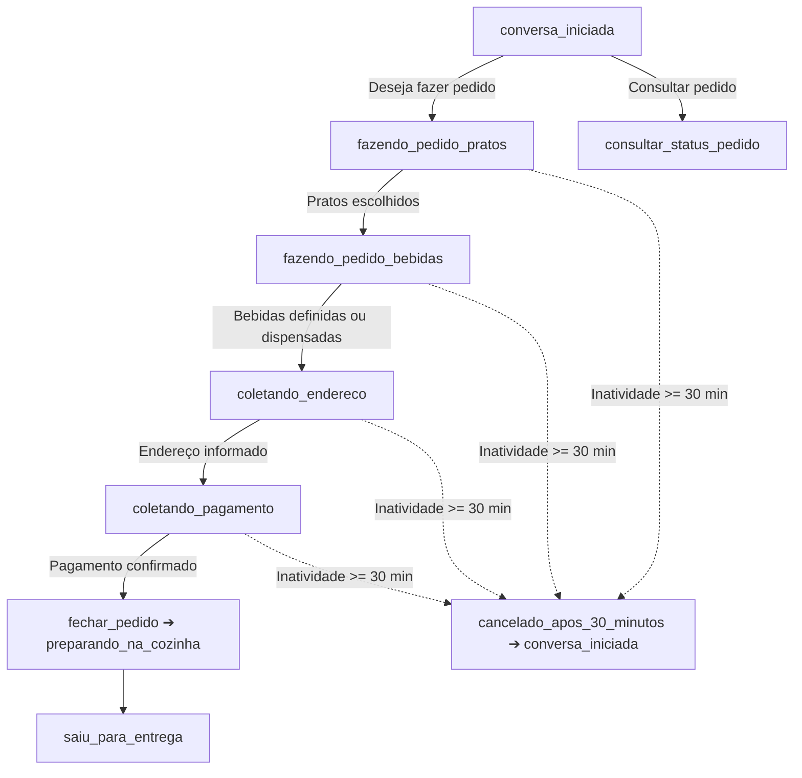

# ANDAMENTO.md · Contexto Consolidado do Projeto

> **📌 REGRA PARA A IA:** Leia este documento no início de qualquer nova sessão para absorver todo o contexto do projeto de forma instantânea e com economia máxima de tokens.

---

## 1. 🏢 Negócio e Identidade
* **Empresa:** Restaurante Família Ricardo (desde 2018).
* **Segmento:** Refeições caseiras, pratos executivos, pratos do dia, porções e bebidas.
* **Canal de Vendas:** Delivery e atendimento automático via WhatsApp oficial (Meta Cloud API).
* **Endereço:** Av. Irineu Mendes de Souza, 1531, Martim de Sá - Caraguatatuba/SP.
* **Horário:** Segunda a sábado, das 11:00 às 14:30. Domingo fechado.
* **Contatos:** (12) 99750-0045 / (12) 98146-4976.

---

## 2. 🍽️ Cardápio & Tabela de Preços (`negocio.md`)

| Categoria | Item | Tamanho(s) | Preço (R$) |
| :--- | :--- | :--- | :--- |
| **Pratos Diários** | Filé de Frango Acebolado | Infantil / Grande | R$ 25,00 / R$ 30,00 |
| | Filé de Frango à Parmegiana | Grande | R$ 30,00 |
| | Filé de Frango à Milanesa | Grande | R$ 30,00 |
| | Calabresa Acebolada | Infantil / Médio / Grande | R$ 20,00 / R$ 25,00 / R$ 30,00 |
| | Calabresa com Queijo | Infantil / Médio / Grande | R$ 25,00 / R$ 25,00 / R$ 30,00 |
| | Bife em Tiras Acebolado | Infantil / Médio / Grande | R$ 25,00 / R$ 25,00 / R$ 35,00 |
| | Bife em Tiras com Queijo | Infantil / Médio / Grande | R$ 25,00 / R$ 25,00 / R$ 35,00 |
| | Omelete | Infantil / Médio / Grande | R$ 25,00 / R$ 25,00 / R$ 28,00 |
| **Prato do Dia** | Feijoada Tradicional | Quarta e Sábado | Conforme tabela do dia |
| | Pratos Variados | Seg, Ter, Qui, Sex | Conforme tabela do dia |
| **Porções** | Batata Frita | Pequena / Média | R$ 15,00 / R$ 23,00 |
| | Batata com Queijo | Pequena / Média | R$ 18,00 / R$ 28,00 |
| | Feijão Carioca | Pequena / Média | R$ 15,00 / R$ 25,00 |
| | Arroz Branco | Porção | Consultar |
| **Adicionais** | Farofa / Mix Legumes Refogados / Ovo | Porção | R$ 7,00 / R$ 7,00 / R$ 2,00 |
| **Cervejas** | Skol (350ml) / Budweiser LN / Heineken LN | Unidade | R$ 8,00 / R$ 12,00 / R$ 12,00 |
| **Bebidas** | Água / Refri Lata / Tubaína 600ml / Suco Del Valle / Limoneto | Unidade | R$ 5,00 / R$ 8,00 / R$ 8,00 / R$ 10,00 / R$ 10,00 |
| | Refrigerante 2L / Coca-Cola 2L | Garrafa | R$ 14,00 / R$ 20,00 |

---

## 3. 🤖 Fluxo de Atendimento do Robô & Máquina de Estados da Conversa

### Estados Conversacionais (`STATUS_CONVERSA`):
1. `conversa_iniciada`: Cliente iniciou contato ou saudação ("oi", "olá"). O bot verifica se deseja fazer pedido ou consultar status.
2. `fazendo_pedido_pratos`: O cliente escolhe os pratos principais, porções e tamanhos (Infantil, Médio, Grande).
3. `fazendo_pedido_bebidas`: Pratos definidos. O bot apresenta e coleta as bebidas (Refrigerantes, Sucos, Água, Cervejas) ou confirma se dispensa.
4. `coletando_endereco`: Pratos e bebidas definidos. O bot solicita os dados de entrega (Rua, Número, Bairro, CEP/Ponto de Referência e Nome).
5. `coletando_pagamento`: Endereço informado. O bot solicita a forma de pagamento (Cartão de Crédito, Débito, Pix ou Dinheiro) e troco se aplicável.
6. `preparando_na_cozinha`: Pedido fechado com sucesso (`fechar_pedido`), comanda gerada e pedido em produção.
7. `saiu_para_entrega`: Pedido despachado para entrega com motoboy.
8. `cancelado_apos_30_minutos`: Inatividade superior a 30 minutos em pedidos em andamento cancela o rascunho e reinicia o fluxo.

> ⏱️ **Regra de Continuidade e Limite de 30 Minutos:**
> - **Antes de 30 minutos de inatividade:** Ao receber nova mensagem, o bot verifica o status atual do cliente e continua exatamente do ponto em que parou (se estava escolhendo pratos continua nos pratos; se estava nas bebidas continua nas bebidas; se estava no endereço continua no endereço; se estava no pagamento continua no pagamento).
> - **Após 30 minutos de inatividade sem fechar o pedido:** O status é resetado para `conversa_iniciada`, limpando o rascunho temporário.

---

## 4. 🗂️ Estrutura e Papel dos Arquivos

### 🚀 Backend API (Laravel 12 / PHP 8.5) — `backend/`
* [backend/routes/api.php](file:///c:/@PROJETOS/APP/restaurante-ricardo-whatsapp/backend/routes/api.php): Endpoints REST para Dashboard, Pedidos, Clientes, Cardápio e Atendimentos.
* [backend/app/Http/Controllers/DashboardController.php](file:///c:/@PROJETOS/APP/restaurante-ricardo-whatsapp/backend/app/Http/Controllers/DashboardController.php): KPIs em tempo real, gráfico de vendas, top produtos, mapa de bairros e métricas de IA.
* [backend/app/Http/Controllers/PedidoController.php](file:///c:/@PROJETOS/APP/restaurante-ricardo-whatsapp/backend/app/Http/Controllers/PedidoController.php): Gestão e avanço de status dos pedidos da cozinha.
* [backend/app/Models/](file:///c:/@PROJETOS/APP/restaurante-ricardo-whatsapp/backend/app/Models/): 10 Models Eloquent com relacionamentos (Cliente, Pedido, Endereco, Categoria, Produto, Atendimento, etc.).
* [backend/database/migrations/](file:///c:/@PROJETOS/APP/restaurante-ricardo-whatsapp/backend/database/migrations/): Migrations relacionais completas para MySQL 8.0+.
* [backend/database/seeders/](file:///c:/@PROJETOS/APP/restaurante-ricardo-whatsapp/backend/database/seeders/): Cardápio oficial e mock de dados realistas para o Dashboard.

### 🎨 Frontend Dashboard (Angular 22 / Standalone / Signals) — `frontend/`
* [frontend/src/app/pages/dashboard/](file:///c:/@PROJETOS/APP/restaurante-ricardo-whatsapp/frontend/src/app/pages/dashboard/): Painel executivo com cards KPI, gráficos Chart.js (vendas diárias e pagamentos), funil de pedidos e curva ABC de produtos.
* [frontend/src/app/pages/pedidos/](file:///c:/@PROJETOS/APP/restaurante-ricardo-whatsapp/frontend/src/app/pages/pedidos/): Quadro operacional da cozinha com transição de status (Pendente -> Em Preparo -> Em Rota -> Entregue).
* [frontend/src/app/pages/clientes/](file:///c:/@PROJETOS/APP/restaurante-ricardo-whatsapp/frontend/src/app/pages/clientes/): Tabela com LTV (Lifetime Value), recorrência e link direto para conversa no WhatsApp.
* [frontend/src/app/pages/cardapio/](file:///c:/@PROJETOS/APP/restaurante-ricardo-whatsapp/frontend/src/app/pages/cardapio/): Gestão de pratos e toggle instantâneo de disponibilidade no robô.
* [frontend/src/app/pages/atendimentos/](file:///c:/@PROJETOS/APP/restaurante-ricardo-whatsapp/frontend/src/app/pages/atendimentos/): Monitoramento de conversas da IA e alertas de transbordo humano.

### 🤖 Bot WhatsApp & Banco
* [database/schema.sql](file:///c:/@PROJETOS/APP/restaurante-ricardo-whatsapp/database/schema.sql): DDL completo do banco `agente-watsapp` em MySQL (10 tabelas relacionais).
* [database/seeds.sql](file:///c:/@PROJETOS/APP/restaurante-ricardo-whatsapp/database/seeds.sql): Carga inicial oficial com categorias, produtos e variações de preços do restaurante.
* [database/views.sql](file:///c:/@PROJETOS/APP/restaurante-ricardo-whatsapp/database/views.sql): Views analíticas pré-calculadas para métricas operacionais e executivas do Dashboard.
* [README.md](file:///c:/@PROJETOS/APP/restaurante-ricardo-whatsapp/README.md): Documentação completa do projeto, fluxo de atendimento, setup e comandos.
* [.gitignore](file:///c:/@PROJETOS/APP/restaurante-ricardo-whatsapp/.gitignore): Proteção de credenciais (.env), logs e arquivos de runtime.
* [negocio.md](file:///c:/@PROJETOS/APP/restaurante-ricardo-whatsapp/negocio.md): Ficha de verdade do restaurante (cardápio, regras, horários, endereço).
* [cerebro.js](file:///c:/@PROJETOS/APP/restaurante-ricardo-whatsapp/cerebro.js):
  - Memória local persistida ([memoria.json](file:///c:/@PROJETOS/APP/restaurante-ricardo-whatsapp/memoria.json), janela de 30 min por inatividade).
  - Chamada à API OpenRouter com `google/gemini-3.7-flash` e `max_tokens: 450`.
  - Tratamento resiliente e amigável para erros de API (402/429/limite de créditos com direcionamento para telefone da loja).
  - Serialização de concorrência por telefone (`responderNaFila`).
  - Máquina de estados conversacional (`STATUS_CONVERSA`) com ferramentas: `atualizar_status_conversa`, `fechar_pedido`, `consultar_status_pedido`, `chamar_atendente`.
  - **Envio Direto da Tabela de Pedidos:** Ao fechar o pedido ou consultar o status, a resposta enviada ao cliente é consultada diretamente da tabela e formatada de forma determinística, sem deixar a geração do comprovante para a IA.
* [pedidos.js](file:///c:/@PROJETOS/APP/restaurante-ricardo-whatsapp/pedidos.js):
  - Banco de pedidos persistido ([pedidos.json](file:///c:/@PROJETOS/APP/restaurante-ricardo-whatsapp/pedidos.json)) e sincronização REST com API Laravel/MySQL.
  - Funções de busca direta na tabela: `obterPedidoPorId` e `obterUltimoPedidoPorTelefone`.
  - Geração de IDs (`PED-DDHHMM-XXX`).
  - Formatação e impressão térmica da comanda da cozinha (`formatarComanda`, `imprimirComanda`).
  - Geração de mensagem oficial formatada para o cliente (`formatarMensagemConfirmacaoCliente` e `formatarMensagemStatusCliente`).
* [agente.js](file:///c:/@PROJETOS/APP/restaurante-ricardo-whatsapp/agente.js):
  - Servidor HTTP Node.js sem dependências para o webhook da Meta (`/webhook`).
  - Validação de assinatura HMAC-SHA256 (`x-hub-signature-256`) e deduplicação de mensagens.
* [simular.js](file:///c:/@PROJETOS/APP/restaurante-ricardo-whatsapp/simular.js):
  - Interface CLI interativa para simular atendimentos e pedidos via terminal (`npm run simular`).
* [testar.js](file:///c:/@PROJETOS/APP/restaurante-ricardo-whatsapp/testar.js):
  - Bateria de testes automatizados (`npm run testar`).
* [.env](file:///c:/@PROJETOS/APP/restaurante-ricardo-whatsapp/.env):
  - Chaves de acesso da Meta, OpenRouter e credenciais MySQL.

---

## 5. 🗄️ Arquitetura de Banco de Dados (`agente-watsapp`)
* **SGBD:** MySQL 8.0+
* **Tabelas Operacionais:** `clientes`, `enderecos`, `categorias`, `produtos`, `produto_variacoes`, `pedidos`, `pedido_itens`, `pedido_item_adicionais`.
* **Tabelas Analíticas (Dashboard):** `atendimentos` (TMA, taxa de conversão do bot, transbordo) e `historico_status_pedidos` (lead time / tempo de preparo e entrega).
* **Views Analíticas:** `v_dashboard_kpis_gerais`, `v_dashboard_vendas_por_dia`, `v_dashboard_ranking_produtos`, `v_dashboard_mapa_bairros`, `v_dashboard_formas_pagamento`, `v_dashboard_metricas_ia_atendimento`.

---

## 6. ⚙️ Comandos Úteis
* **API Laravel (Backend):** `npm run start:api` ou `cd backend && php artisan serve`
* **Dashboard Angular (Frontend):** `npm run start:front` ou `cd frontend && npm start`
* **Robô WhatsApp:** `npm run start:bot` ou `npm start`
* **Testes Automatizados:** `npm run testar`
* **Simulador no Terminal:** `npm run simular`

---

## 7. 🧩 Regras e Perfis de Engenharia Instalados (`.agents/rules/`)
* [clean-architecture.md](file:///c:/@PROJETOS/APP/restaurante-ricardo-whatsapp/.agents/rules/clean-architecture.md): Princípios SOLID, divisão de camadas (Domínio, Casos de Uso, Adaptadores, Infra) e código limpo.
* [web-design-system.md](file:///c:/@PROJETOS/APP/restaurante-ricardo-whatsapp/.agents/rules/web-design-system.md): Padrões de UI/UX, Design System, micro-animações, responsividade e tipografia.
* [nodejs-patterns.md](file:///c:/@PROJETOS/APP/restaurante-ricardo-whatsapp/.agents/rules/nodejs-patterns.md): Segurança de webhooks, resiliência de filas assíncronas e observabilidade.
* [andamento.md](file:///c:/@PROJETOS/APP/restaurante-ricardo-whatsapp/.agents/rules/andamento.md): Leitura e atualização contínua do histórico do projeto.

---

## 8. 📋 Lista de To-Do (Implementações)

- [x] **1. Visão de Lista e Cards no Frontend (Angular):**
  - Implementada alternância dinâmica (toggle switch) na tela de pedidos entre:
    - **Visão em Cards (Kanban / Grid):** Visual ágil para acompanhamento rápido de status na cozinha/expedição.
    - **Visão em Lista (Tabela com filtros):** Visual denso com colunas detalhadas (código, data/hora, cliente/WhatsApp, endereço/bairro, itens, pagamento/troco, valor total, status e ações rápidas).

- [x] **2. Automação de Notificação de Saída para Entrega (WhatsApp):**
  - Ao funcionário clicar em **"🛵 Despachar (Notificar Cliente)"** no painel/dashboard:
    - Notificação disparada automaticamente no WhatsApp com toast visual no dashboard:
      > *"🛵💨 Temos uma ótima notícia! O seu pedido [Nº PEDIDO] acabou de sair para entrega e já está a caminho!"*
    - Atualização simultânea das tabelas `pedidos`, `historico_status_pedidos` e `status_conversas` para o status `saiu_para_entrega`.

- [x] **3. Cardápio Dinâmico da Tabela de Produtos & CRUD Completo de Pratos:**
  - **Injeção Dinâmica na IA:** O bot WhatsApp (`cerebro.js` via `GET /api/cardapio/texto`) obtém os pratos, porções, bebidas e preços diretamente das tabelas relacionais `produtos` e `produto_variacoes` filtrando apenas registros com `ativo = 1`.
  - **CRUD de Pratos no Backend (Laravel):**
    - `GET /api/cardapio`: Lista todos os pratos com categorias e variações de tamanho/preço.
    - `GET /api/cardapio/categorias`: Categorias disponíveis para cadastro.
    - `GET /api/cardapio/texto`: Texto oficial formatado para o prompt do bot.
    - `POST /api/cardapio`: Criação de novo prato com variações dinâmicas de preços.
    - `PUT /api/cardapio/{id}`: Edição completa de nome, categoria, descrição, ativo e variações.
    - `DELETE /api/cardapio/{id}`: Exclusão com cascata de variações.
    - `PATCH /api/cardapio/{id}/toggle-status`: Alternância instantânea de Ativo / Pausado no WhatsApp.
  - **CRUD de Pratos no Frontend (Angular):**
    - Modal interativo para adicionar novo prato ou editar prato existente.
    - Gestão inline de múltiplas variações de tamanho (Infantil, Médio, Grande, etc.) e valores em R$.
    - Toggle visual e ágil de "Ativo / Pausado" por card e tabela.
    - Filtros por categoria e busca textual em tempo real.

- [x] **4. Visão em Lista e Cards no Monitor de Atendimentos IA (Angular):**
  - Implementado alternador de visualização (`modoVisao`: Cards vs Lista) na tela [atendimentos.component.ts](file:///c:/@PROJETOS/APP/restaurante-ricardo-whatsapp/frontend/src/app/pages/atendimentos/atendimentos.component.ts).
  - **Visão em Lista:** Tabela com Telefone/Avatar, data/hora do último contato, badge de estágio da IA, tags inline do rascunho (pratos, bebidas, endereço e pagamento), horário de expiração de 30 minutos e botão de ação rápida para abertura da conversa no WhatsApp.

- [x] **5. Homologação Oficial de Webhook & Atendimento via WhatsApp Real:**
  - Configuração do túnel Cloudflare (`trycloudflare.com`) e integração bidirecional com a Meta WhatsApp Cloud API.
  - Correção de payloads de mensagens, aumento de tokens contextuais para 1500 tokens e validação de sessão em tempo real com o celular do cliente.

- [x] **6. Status de Digitando & Idempotência no Despacho de Pedidos:**
  - **Status de Digitando / Lida:** O robô marca imediatamente a mensagem recebida como lida na Meta Cloud API para dar feedback visual instantâneo ao cliente de que a mensagem está sendo processada.
  - **Idempotência no Despacho (3 Camadas):**
    - *Frontend (Angular):* Botão "Despachar" desabilita imediatamente ao ser clicado, exibindo `⏳ Despachando & Notificando...` e impedindo múltiplos cliques acidentais tanto em Cards quanto na Lista.
    - *Backend (Laravel):* Só dispara notificação de saída para o WhatsApp se o status anterior for estritamente diferente de `saiu_para_entrega`, enviando `idempotency_key` única.
    - *Agente Webhook (Node.js):* Endpoint `/api/notificar` deduplica e bloqueia mensagens repetidas com a mesma chave dentro de uma janela de 10 minutos.

- [x] **7. Reset do Status do Cliente pós-Fechamento de Pedido:**
  - Ao concluir a ferramenta `fechar_pedido`, o pedido é salvo com status `pendente`/`em_preparo` e o estado conversacional do cliente volta imediatamente para `conversa_iniciada` (`STATUS_CONVERSA.INICIADA`), limpando o rascunho de compra e armazenando `ultimoPedidoId`.
  - Sincronização em tempo real na memória local e na tabela `status_conversas` do MySQL, deixando o cliente apto para nova interação ou consulta de status.

- [x] **8. Tabela de Status de Pedidos (`status_pedidos`):**
  - Criação da tabela mestre de catálogo de status no MySQL: `status_pedidos` com campos `id`, `codigo`, `nome`, `descricao`, `cor_badge`, `icone`, `ordem`, `ativo`, `created_at`, `updated_at`.
  - Migration executada e populada com os 6 status oficiais: `pendente` (⏳ #F59E0B), `confirmado` (📋 #3B82F6), `em_preparo` (👨‍🍳 #8B5CF6), `saiu_para_entrega` (🛵 #06B6D4), `entregue` (✅ #10B981) e `cancelado` (❌ #EF4444).
  - Model Eloquent `StatusPedido.php`, relacionamento `statusCatalogo()` no Model `Pedido.php` e endpoint `GET /api/status-pedidos`.
  - DDL e seeds atualizados em `database/schema.sql` e `database/seeds.sql`.

