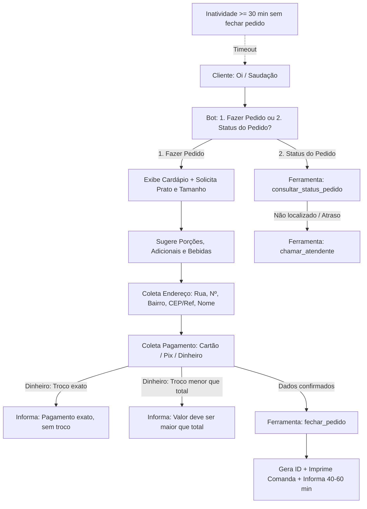

# ANDAMENTO.md · Contexto Consolidado do Projeto

> **📌 REGRA PARA A IA:** Leia este documento no início de qualquer nova sessão para absorver todo o contexto do projeto de forma instantânea e com economia máxima de tokens.

---

## 1. 🏢 Negócio e Identidade
* **Empresa:** Restaurante Família Ricardo (desde 2018).
* **Segmento:** Refeições caseiras, pratos executivos, pratos do dia, porções e bebidas.
* **Canal de Vendas:** Delivery e atendimento automático via WhatsApp oficial (Meta Cloud API).
* **Endereço:** Av. Irineu Mendes de Souza, 1531, Martim de Sá - Caraguatatuba/SP.
* **Horário:** Segunda a sábado, das 11:00 às 14:30. Domingo fechado.
* **Contatos:** (12) 99750-0045 / (12) 98146-4976.

---

## 2. 🍽️ Cardápio & Tabela de Preços (`negocio.md`)

| Categoria | Item | Tamanho(s) | Preço (R$) |
| :--- | :--- | :--- | :--- |
| **Pratos Diários** | Filé de Frango Acebolado | Infantil / Grande | R$ 25,00 / R$ 30,00 |
| | Filé de Frango à Parmegiana | Grande | R$ 30,00 |
| | Filé de Frango à Milanesa | Grande | R$ 30,00 |
| | Calabresa Acebolada | Infantil / Médio / Grande | R$ 20,00 / R$ 25,00 / R$ 30,00 |
| | Calabresa com Queijo | Infantil / Médio / Grande | R$ 25,00 / R$ 25,00 / R$ 30,00 |
| | Bife em Tiras Acebolado | Infantil / Médio / Grande | R$ 25,00 / R$ 25,00 / R$ 35,00 |
| | Bife em Tiras com Queijo | Infantil / Médio / Grande | R$ 25,00 / R$ 25,00 / R$ 35,00 |
| | Omelete | Infantil / Médio / Grande | R$ 25,00 / R$ 25,00 / R$ 28,00 |
| **Prato do Dia** | Feijoada Tradicional | Quarta e Sábado | Conforme tabela do dia |
| | Pratos Variados | Seg, Ter, Qui, Sex | Conforme tabela do dia |
| **Porções** | Batata Frita | Pequena / Média | R$ 15,00 / R$ 23,00 |
| | Batata com Queijo | Pequena / Média | R$ 18,00 / R$ 28,00 |
| | Feijão Carioca | Pequena / Média | R$ 15,00 / R$ 25,00 |
| | Arroz Branco | Porção | Consultar |
| **Adicionais** | Farofa / Mix Legumes Refogados / Ovo | Porção | R$ 7,00 / R$ 7,00 / R$ 2,00 |
| **Cervejas** | Skol (350ml) / Budweiser LN / Heineken LN | Unidade | R$ 8,00 / R$ 12,00 / R$ 12,00 |
| **Bebidas** | Água / Refri Lata / Tubaína 600ml / Suco Del Valle / Limoneto | Unidade | R$ 5,00 / R$ 8,00 / R$ 8,00 / R$ 10,00 / R$ 10,00 |
| | Refrigerante 2L / Coca-Cola 2L | Garrafa | R$ 14,00 / R$ 20,00 |

---

## 3. 🤖 Fluxo de Atendimento do Robô

> ⏱️ **Regra de Inatividade (30 minutos):** Caso o cliente fique sem responder por 30 minutos ou mais antes de concluir e fechar o pedido, o estado da conversa é zerado automaticamente, fazendo com que uma nova mensagem retorne ao menu/saudação inicial.

---

## 4. 🗂️ Estrutura e Papel dos Arquivos

### 🚀 Backend API (Laravel 12 / PHP 8.5) — `backend/`
* [backend/routes/api.php](file:///c:/@PROJETOS/APP/restaurante-ricardo-whatsapp/backend/routes/api.php): Endpoints REST para Dashboard, Pedidos, Clientes, Cardápio e Atendimentos.
* [backend/app/Http/Controllers/DashboardController.php](file:///c:/@PROJETOS/APP/restaurante-ricardo-whatsapp/backend/app/Http/Controllers/DashboardController.php): KPIs em tempo real, gráfico de vendas, top produtos, mapa de bairros e métricas de IA.
* [backend/app/Http/Controllers/PedidoController.php](file:///c:/@PROJETOS/APP/restaurante-ricardo-whatsapp/backend/app/Http/Controllers/PedidoController.php): Gestão e avanço de status dos pedidos da cozinha.
* [backend/app/Models/](file:///c:/@PROJETOS/APP/restaurante-ricardo-whatsapp/backend/app/Models/): 10 Models Eloquent com relacionamentos (Cliente, Pedido, Endereco, Categoria, Produto, Atendimento, etc.).
* [backend/database/migrations/](file:///c:/@PROJETOS/APP/restaurante-ricardo-whatsapp/backend/database/migrations/): Migrations relacionais completas para MySQL 8.0+.
* [backend/database/seeders/](file:///c:/@PROJETOS/APP/restaurante-ricardo-whatsapp/backend/database/seeders/): Cardápio oficial e mock de dados realistas para o Dashboard.

### 🎨 Frontend Dashboard (Angular 22 / Standalone / Signals) — `frontend/`
* [frontend/src/app/pages/dashboard/](file:///c:/@PROJETOS/APP/restaurante-ricardo-whatsapp/frontend/src/app/pages/dashboard/): Painel executivo com cards KPI, gráficos Chart.js (vendas diárias e pagamentos), funil de pedidos e curva ABC de produtos.
* [frontend/src/app/pages/pedidos/](file:///c:/@PROJETOS/APP/restaurante-ricardo-whatsapp/frontend/src/app/pages/pedidos/): Quadro operacional da cozinha com transição de status (Pendente -> Em Preparo -> Em Rota -> Entregue).
* [frontend/src/app/pages/clientes/](file:///c:/@PROJETOS/APP/restaurante-ricardo-whatsapp/frontend/src/app/pages/clientes/): Tabela com LTV (Lifetime Value), recorrência e link direto para conversa no WhatsApp.
* [frontend/src/app/pages/cardapio/](file:///c:/@PROJETOS/APP/restaurante-ricardo-whatsapp/frontend/src/app/pages/cardapio/): Gestão de pratos e toggle instantâneo de disponibilidade no robô.
* [frontend/src/app/pages/atendimentos/](file:///c:/@PROJETOS/APP/restaurante-ricardo-whatsapp/frontend/src/app/pages/atendimentos/): Monitoramento de conversas da IA e alertas de transbordo humano.

### 🤖 Bot WhatsApp & Banco
* [database/schema.sql](file:///c:/@PROJETOS/APP/restaurante-ricardo-whatsapp/database/schema.sql): DDL completo do banco `agente-watsapp` em MySQL (10 tabelas relacionais).
* [database/seeds.sql](file:///c:/@PROJETOS/APP/restaurante-ricardo-whatsapp/database/seeds.sql): Carga inicial oficial com categorias, produtos e variações de preços do restaurante.
* [database/views.sql](file:///c:/@PROJETOS/APP/restaurante-ricardo-whatsapp/database/views.sql): Views analíticas pré-calculadas para métricas operacionais e executivas do Dashboard.
* [README.md](file:///c:/@PROJETOS/APP/restaurante-ricardo-whatsapp/README.md): Documentação completa do projeto, fluxo de atendimento, setup e comandos.
* [.gitignore](file:///c:/@PROJETOS/APP/restaurante-ricardo-whatsapp/.gitignore): Proteção de credenciais (.env), logs e arquivos de runtime.
* [negocio.md](file:///c:/@PROJETOS/APP/restaurante-ricardo-whatsapp/negocio.md): Ficha de verdade do restaurante (cardápio, regras, horários, endereço).
* [cerebro.js](file:///c:/@PROJETOS/APP/restaurante-ricardo-whatsapp/cerebro.js):
  - Memória local persistida ([memoria.json](file:///c:/@PROJETOS/APP/restaurante-ricardo-whatsapp/memoria.json), janela de 30 min por inatividade).
  - Chamada à API OpenRouter com `google/gemini-3.7-flash` e `max_tokens: 450`.
  - Tratamento resiliente e amigável para erros de API (402/429/limite de créditos com direcionamento para telefone da loja).
  - Serialização de concorrência por telefone (`responderNaFila`).
  - Ferramentas: `fechar_pedido`, `consultar_status_pedido`, `chamar_atendente`.
* [pedidos.js](file:///c:/@PROJETOS/APP/restaurante-ricardo-whatsapp/pedidos.js):
  - Banco de pedidos local ([pedidos.json](file:///c:/@PROJETOS/APP/restaurante-ricardo-whatsapp/pedidos.json)).
  - Geração de IDs (`PED-DDHHMM-XXX`).
  - Formatação e impressão térmica da comanda da cozinha (`formatarComanda`, `imprimirComanda`).
* [agente.js](file:///c:/@PROJETOS/APP/restaurante-ricardo-whatsapp/agente.js):
  - Servidor HTTP Node.js sem dependências para o webhook da Meta (`/webhook`).
  - Validação de assinatura HMAC-SHA256 (`x-hub-signature-256`) e deduplicação de mensagens.
* [simular.js](file:///c:/@PROJETOS/APP/restaurante-ricardo-whatsapp/simular.js):
  - Interface CLI interativa para simular atendimentos e pedidos via terminal (`npm run simular`).
* [testar.js](file:///c:/@PROJETOS/APP/restaurante-ricardo-whatsapp/testar.js):
  - Bateria de testes automatizados (`npm run testar`).
* [.env](file:///c:/@PROJETOS/APP/restaurante-ricardo-whatsapp/.env):
  - Chaves de acesso da Meta, OpenRouter e credenciais MySQL.

---

## 5. 🗄️ Arquitetura de Banco de Dados (`agente-watsapp`)
* **SGBD:** MySQL 8.0+
* **Tabelas Operacionais:** `clientes`, `enderecos`, `categorias`, `produtos`, `produto_variacoes`, `pedidos`, `pedido_itens`, `pedido_item_adicionais`.
* **Tabelas Analíticas (Dashboard):** `atendimentos` (TMA, taxa de conversão do bot, transbordo) e `historico_status_pedidos` (lead time / tempo de preparo e entrega).
* **Views Analíticas:** `v_dashboard_kpis_gerais`, `v_dashboard_vendas_por_dia`, `v_dashboard_ranking_produtos`, `v_dashboard_mapa_bairros`, `v_dashboard_formas_pagamento`, `v_dashboard_metricas_ia_atendimento`.

---

## 6. ⚙️ Comandos Úteis
* **API Laravel (Backend):** `npm run start:api` ou `cd backend && php artisan serve`
* **Dashboard Angular (Frontend):** `npm run start:front` ou `cd frontend && npm start`
* **Robô WhatsApp:** `npm run start:bot` ou `npm start`
* **Testes Automatizados:** `npm run testar`
* **Simulador no Terminal:** `npm run simular`

---

## 7. 🧩 Regras e Perfis de Engenharia Instalados (`.agents/rules/`)
* [clean-architecture.md](file:///c:/@PROJETOS/APP/restaurante-ricardo-whatsapp/.agents/rules/clean-architecture.md): Princípios SOLID, divisão de camadas (Domínio, Casos de Uso, Adaptadores, Infra) e código limpo.
* [web-design-system.md](file:///c:/@PROJETOS/APP/restaurante-ricardo-whatsapp/.agents/rules/web-design-system.md): Padrões de UI/UX, Design System, micro-animações, responsividade e tipografia.
* [nodejs-patterns.md](file:///c:/@PROJETOS/APP/restaurante-ricardo-whatsapp/.agents/rules/nodejs-patterns.md): Segurança de webhooks, resiliência de filas assíncronas e observabilidade.
* [andamento.md](file:///c:/@PROJETOS/APP/restaurante-ricardo-whatsapp/.agents/rules/andamento.md): Leitura e atualização contínua do histórico do projeto.

