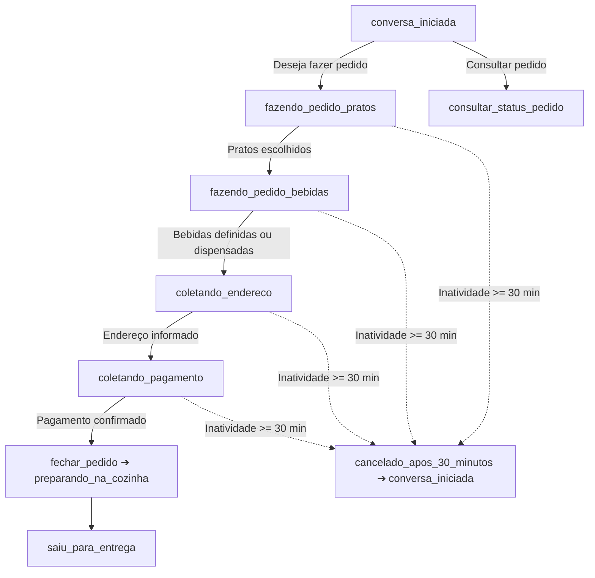

# ANDAMENTO.md · Contexto Consolidado do Projeto

> **📌 REGRA PARA A IA:** Leia este documento no início de qualquer nova sessão para absorver todo o contexto do projeto de forma instantânea e com economia máxima de tokens.

---

## 1. 🏢 Negócio e Identidade
* **Empresa:** Restaurante Família Ricardo (desde 2018).
* **Segmento:** Refeições caseiras, pratos executivos, pratos do dia, porções e bebidas.
* **Canal de Vendas:** Delivery e atendimento automático via WhatsApp oficial (Meta Cloud API).
* **Endereço:** Av. Irineu Mendes de Souza, 1531, Martim de Sá - Caraguatatuba/SP.
* **Horário:** Segunda a sábado, das 11:00 às 14:30. Domingo fechado.
* **Contatos:** (12) 99750-0045 / (12) 98146-4976.

---

## 2. 🍽️ Cardápio & Tabela de Preços (`negocio.md`)

| Categoria | Item | Tamanho(s) | Preço (R$) |
| :--- | :--- | :--- | :--- |
| **Pratos Diários** | Filé de Frango Acebolado | Infantil / Grande | R$ 25,00 / R$ 30,00 |
| | Filé de Frango à Parmegiana | Grande | R$ 30,00 |
| | Filé de Frango à Milanesa | Grande | R$ 30,00 |
| | Calabresa Acebolada | Infantil / Médio / Grande | R$ 20,00 / R$ 25,00 / R$ 30,00 |
| | Calabresa com Queijo | Infantil / Médio / Grande | R$ 25,00 / R$ 25,00 / R$ 30,00 |
| | Bife em Tiras Acebolado | Infantil / Médio / Grande | R$ 25,00 / R$ 25,00 / R$ 35,00 |
| | Bife em Tiras com Queijo | Infantil / Médio / Grande | R$ 25,00 / R$ 25,00 / R$ 35,00 |
| | Omelete | Infantil / Médio / Grande | R$ 25,00 / R$ 25,00 / R$ 28,00 |
| **Prato do Dia** | Feijoada Tradicional | Quarta e Sábado | Conforme tabela do dia |
| | Pratos Variados | Seg, Ter, Qui, Sex | Conforme tabela do dia |
| **Porções** | Batata Frita | Pequena / Média | R$ 15,00 / R$ 23,00 |
| | Batata com Queijo | Pequena / Média | R$ 18,00 / R$ 28,00 |
| | Feijão Carioca | Pequena / Média | R$ 15,00 / R$ 25,00 |
| | Arroz Branco | Porção | Consultar |
| **Adicionais** | Farofa / Mix Legumes Refogados / Ovo | Porção | R$ 7,00 / R$ 7,00 / R$ 2,00 |
| **Cervejas** | Skol (350ml) / Budweiser LN / Heineken LN | Unidade | R$ 8,00 / R$ 12,00 / R$ 12,00 |
| **Bebidas** | Água / Refri Lata / Tubaína 600ml / Suco Del Valle / Limoneto | Unidade | R$ 5,00 / R$ 8,00 / R$ 8,00 / R$ 10,00 / R$ 10,00 |
| | Refrigerante 2L / Coca-Cola 2L | Garrafa | R$ 14,00 / R$ 20,00 |

---

## 3. 🤖 Fluxo de Atendimento do Robô & Máquina de Estados da Conversa

### Estados Conversacionais (`STATUS_CONVERSA`):
1. `conversa_iniciada`: Cliente iniciou contato ou saudação ("oi", "olá"). O bot verifica se deseja fazer pedido ou consultar status.
2. `fazendo_pedido_pratos`: O cliente escolhe os pratos principais, porções e tamanhos (Infantil, Médio, Grande).
3. `fazendo_pedido_bebidas`: Pratos definidos. O bot apresenta e coleta as bebidas (Refrigerantes, Sucos, Água, Cervejas) ou confirma se dispensa.
4. `coletando_endereco`: Pratos e bebidas definidos. O bot solicita os dados de entrega (Rua, Número, Bairro, CEP/Ponto de Referência e Nome).
5. `coletando_pagamento`: Endereço informado. O bot solicita a forma de pagamento (Cartão de Crédito, Débito, Pix ou Dinheiro) e troco se aplicável.
6. `preparando_na_cozinha`: Pedido fechado com sucesso (`fechar_pedido`), comanda gerada e pedido em produção.
7. `saiu_para_entrega`: Pedido despachado para entrega com motoboy.
8. `cancelado_apos_30_minutos`: Inatividade superior a 30 minutos em pedidos em andamento cancela o rascunho e reinicia o fluxo.

> ⏱️ **Regra de Continuidade e Limite de 30 Minutos:**
> - **Antes de 30 minutos de inatividade:** Ao receber nova mensagem, o bot verifica o status atual do cliente e continua exatamente do ponto em que parou (se estava escolhendo pratos continua nos pratos; se estava nas bebidas continua nas bebidas; se estava no endereço continua no endereço; se estava no pagamento continua no pagamento).
> - **Após 30 minutos de inatividade sem fechar o pedido:** O status é resetado para `conversa_iniciada`, limpando o rascunho temporário.

---

## 4. 🗂️ Estrutura e Papel dos Arquivos

### 🚀 Backend API (Laravel 13 / PHP 8.5) — `backend/`
* [backend/routes/api.php](file:///c:/@PROJETOS/APP/restaurante-ricardo-whatsapp/backend/routes/api.php): Endpoints REST para Dashboard, Pedidos, Clientes, Cardápio e Atendimentos.
* [backend/app/Http/Controllers/DashboardController.php](file:///c:/@PROJETOS/APP/restaurante-ricardo-whatsapp/backend/app/Http/Controllers/DashboardController.php): KPIs em tempo real, gráfico de vendas, top produtos, mapa de bairros e métricas de IA.
* [backend/app/Http/Controllers/PedidoController.php](file:///c:/@PROJETOS/APP/restaurante-ricardo-whatsapp/backend/app/Http/Controllers/PedidoController.php): Gestão e avanço de status dos pedidos da cozinha.
* [backend/app/Models/](file:///c:/@PROJETOS/APP/restaurante-ricardo-whatsapp/backend/app/Models/): 10 Models Eloquent com relacionamentos (Cliente, Pedido, Endereco, Categoria, Produto, Atendimento, etc.).
* [backend/database/migrations/](file:///c:/@PROJETOS/APP/restaurante-ricardo-whatsapp/backend/database/migrations/): Migrations relacionais completas para MySQL 8.0+.
* [backend/database/seeders/](file:///c:/@PROJETOS/APP/restaurante-ricardo-whatsapp/backend/database/seeders/): Cardápio oficial e mock de dados realistas para o Dashboard.

### 🎨 Frontend Dashboard (Angular 22 / Standalone / Signals) — `frontend/`
* [frontend/src/app/pages/dashboard/](file:///c:/@PROJETOS/APP/restaurante-ricardo-whatsapp/frontend/src/app/pages/dashboard/): Painel executivo com cards KPI, gráficos Chart.js (vendas diárias e pagamentos), funil de pedidos e curva ABC de produtos.
* [frontend/src/app/pages/pedidos/](file:///c:/@PROJETOS/APP/restaurante-ricardo-whatsapp/frontend/src/app/pages/pedidos/): Quadro operacional da cozinha com transição de status (Pendente -> Em Preparo -> Em Rota -> Entregue).
* [frontend/src/app/pages/clientes/](file:///c:/@PROJETOS/APP/restaurante-ricardo-whatsapp/frontend/src/app/pages/clientes/): Tabela com LTV (Lifetime Value), recorrência e link direto para conversa no WhatsApp.
* [frontend/src/app/pages/cardapio/](file:///c:/@PROJETOS/APP/restaurante-ricardo-whatsapp/frontend/src/app/pages/cardapio/): Gestão de pratos e toggle instantâneo de disponibilidade no robô.
* [frontend/src/app/pages/atendimentos/](file:///c:/@PROJETOS/APP/restaurante-ricardo-whatsapp/frontend/src/app/pages/atendimentos/): Monitoramento de conversas da IA e alertas de transbordo humano.

### 🤖 Bot WhatsApp & Banco
* [database/schema.sql](file:///c:/@PROJETOS/APP/restaurante-ricardo-whatsapp/database/schema.sql): DDL completo do banco `agente-watsapp` em MySQL (10 tabelas relacionais).
* [database/seeds.sql](file:///c:/@PROJETOS/APP/restaurante-ricardo-whatsapp/database/seeds.sql): Carga inicial oficial com categorias, produtos e variações de preços do restaurante.
* [database/views.sql](file:///c:/@PROJETOS/APP/restaurante-ricardo-whatsapp/database/views.sql): Views analíticas pré-calculadas para métricas operacionais e executivas do Dashboard.
* [README.md](file:///c:/@PROJETOS/APP/restaurante-ricardo-whatsapp/README.md): Documentação completa do projeto, fluxo de atendimento, setup e comandos.
* [.gitignore](file:///c:/@PROJETOS/APP/restaurante-ricardo-whatsapp/.gitignore): Proteção de credenciais (.env), logs e arquivos de runtime.
* [negocio.md](file:///c:/@PROJETOS/APP/restaurante-ricardo-whatsapp/negocio.md): Ficha de verdade do restaurante (cardápio, regras, horários, endereço).
* [cerebro.js](file:///c:/@PROJETOS/APP/restaurante-ricardo-whatsapp/cerebro.js):
  - Memória local persistida ([memoria.json](file:///c:/@PROJETOS/APP/restaurante-ricardo-whatsapp/memoria.json), janela de 30 min por inatividade).
  - Chamada à API OpenRouter com `google/gemini-3.7-flash` e `max_tokens: 450`.
  - Tratamento resiliente e amigável para erros de API (402/429/limite de créditos com direcionamento para telefone da loja).
  - Serialização de concorrência por telefone (`responderNaFila`).
  - Máquina de estados conversacional (`STATUS_CONVERSA`) com ferramentas: `atualizar_status_conversa`, `fechar_pedido`, `consultar_status_pedido`, `chamar_atendente`.
  - **Envio Direto da Tabela de Pedidos:** Ao fechar o pedido ou consultar o status, a resposta enviada ao cliente é consultada diretamente da tabela e formatada de forma determinística, sem deixar a geração do comprovante para a IA.
* [pedidos.js](file:///c:/@PROJETOS/APP/restaurante-ricardo-whatsapp/pedidos.js):
  - Banco de pedidos persistido ([pedidos.json](file:///c:/@PROJETOS/APP/restaurante-ricardo-whatsapp/pedidos.json)) e sincronização REST com API Laravel/MySQL.
  - Funções de busca direta na tabela: `obterPedidoPorId` e `obterUltimoPedidoPorTelefone`.
  - Geração de IDs (`PED-DDHHMM-XXX`).
  - Formatação e impressão térmica da comanda da cozinha (`formatarComanda`, `imprimirComanda`).
  - Geração de mensagem oficial formatada para o cliente (`formatarMensagemConfirmacaoCliente` e `formatarMensagemStatusCliente`).
* [agente.js](file:///c:/@PROJETOS/APP/restaurante-ricardo-whatsapp/agente.js):
  - Servidor HTTP Node.js sem dependências para o webhook da Meta (`/webhook`).
  - Validação de assinatura HMAC-SHA256 (`x-hub-signature-256`) e deduplicação de mensagens.
* [simular.js](file:///c:/@PROJETOS/APP/restaurante-ricardo-whatsapp/simular.js):
  - Interface CLI interativa para simular atendimentos e pedidos via terminal (`npm run simular`).
* [testar.js](file:///c:/@PROJETOS/APP/restaurante-ricardo-whatsapp/testar.js):
  - Bateria de testes automatizados (`npm run testar`).
* [.env](file:///c:/@PROJETOS/APP/restaurante-ricardo-whatsapp/.env):
  - Chaves de acesso da Meta, OpenRouter e credenciais MySQL.

---

## 5. 🗄️ Arquitetura de Banco de Dados (`agente-watsapp`)
* **SGBD:** MySQL 8.0+
* **Tabelas Operacionais:** `clientes`, `enderecos`, `categorias`, `produtos`, `produto_variacoes`, `pedidos`, `pedido_itens`, `pedido_item_adicionais`.
* **Tabelas Analíticas (Dashboard):** `atendimentos` (TMA, taxa de conversão do bot, transbordo) e `historico_status_pedidos` (lead time / tempo de preparo e entrega).
* **Views Analíticas:** `v_dashboard_kpis_gerais`, `v_dashboard_vendas_por_dia`, `v_dashboard_ranking_produtos`, `v_dashboard_mapa_bairros`, `v_dashboard_formas_pagamento`, `v_dashboard_metricas_ia_atendimento`.

---

## 6. ⚙️ Comandos Úteis
* **API Laravel (Backend):** `npm run start:api` ou `cd backend && php artisan serve`
* **Dashboard Angular (Frontend):** `npm run start:front` ou `cd frontend && npm start`
* **Robô WhatsApp:** `npm run start:bot` ou `npm start`
* **Testes Automatizados:** `npm run testar`
* **Simulador no Terminal:** `npm run simular`

---

## 7. 🧩 Regras e Perfis de Engenharia Instalados (`.agents/rules/`)
* [clean-architecture.md](file:///c:/@PROJETOS/APP/restaurante-ricardo-whatsapp/.agents/rules/clean-architecture.md): Princípios SOLID, divisão de camadas (Domínio, Casos de Uso, Adaptadores, Infra) e código limpo.
* [web-design-system.md](file:///c:/@PROJETOS/APP/restaurante-ricardo-whatsapp/.agents/rules/web-design-system.md): Padrões de UI/UX, Design System, micro-animações, responsividade e tipografia.
* [nodejs-patterns.md](file:///c:/@PROJETOS/APP/restaurante-ricardo-whatsapp/.agents/rules/nodejs-patterns.md): Segurança de webhooks, resiliência de filas assíncronas e observabilidade.
* [andamento.md](file:///c:/@PROJETOS/APP/restaurante-ricardo-whatsapp/.agents/rules/andamento.md): Leitura e atualização contínua do histórico do projeto.

---

## 8. 📋 Lista de To-Do (Implementações)

- [x] **1. Visão de Lista e Cards no Frontend (Angular):**
  - Implementada alternância dinâmica (toggle switch) na tela de pedidos entre:
    - **Visão em Cards (Kanban / Grid):** Visual ágil para acompanhamento rápido de status na cozinha/expedição.
    - **Visão em Lista (Tabela com filtros):** Visual denso com colunas detalhadas (código, data/hora, cliente/WhatsApp, endereço/bairro, itens, pagamento/troco, valor total, status e ações rápidas).

- [x] **2. Automação de Notificação de Saída para Entrega (WhatsApp):**
  - Ao funcionário clicar em **"🛵 Despachar (Notificar Cliente)"** no painel/dashboard:
    - Notificação disparada automaticamente no WhatsApp com toast visual no dashboard:
      > *"🛵💨 Temos uma ótima notícia! O seu pedido [Nº PEDIDO] acabou de sair para entrega e já está a caminho!"*
    - Atualização simultânea das tabelas `pedidos`, `historico_status_pedidos` e `status_conversas` para o status `saiu_para_entrega`.

- [x] **3. Cardápio Dinâmico da Tabela de Produtos & CRUD Completo de Pratos:**
  - **Injeção Dinâmica na IA:** O bot WhatsApp (`cerebro.js` via `GET /api/cardapio/texto`) obtém os pratos, porções, bebidas e preços diretamente das tabelas relacionais `produtos` e `produto_variacoes` filtrando apenas registros com `ativo = 1`.
  - **CRUD de Pratos no Backend (Laravel):**
    - `GET /api/cardapio`: Lista todos os pratos com categorias e variações de tamanho/preço.
    - `GET /api/cardapio/categorias`: Categorias disponíveis para cadastro.
    - `GET /api/cardapio/texto`: Texto oficial formatado para o prompt do bot.
    - `POST /api/cardapio`: Criação de novo prato com variações dinâmicas de preços.
    - `PUT /api/cardapio/{id}`: Edição completa de nome, categoria, descrição, ativo e variações.
    - `DELETE /api/cardapio/{id}`: Exclusão com cascata de variações.
    - `PATCH /api/cardapio/{id}/toggle-status`: Alternância instantânea de Ativo / Pausado no WhatsApp.
  - **CRUD de Pratos no Frontend (Angular):**
    - Modal interativo para adicionar novo prato ou editar prato existente.
    - Gestão inline de múltiplas variações de tamanho (Infantil, Médio, Grande, etc.) e valores em R$.
    - Toggle visual e ágil de "Ativo / Pausado" por card e tabela.
    - Filtros por categoria e busca textual em tempo real.

- [x] **4. Visão em Lista e Cards no Monitor de Atendimentos IA (Angular):**
  - Implementado alternador de visualização (`modoVisao`: Cards vs Lista) na tela [atendimentos.component.ts](file:///c:/@PROJETOS/APP/restaurante-ricardo-whatsapp/frontend/src/app/pages/atendimentos/atendimentos.component.ts).
  - **Visão em Lista:** Tabela com Telefone/Avatar, data/hora do último contato, badge de estágio da IA, tags inline do rascunho (pratos, bebidas, endereço e pagamento), horário de expiração de 30 minutos e botão de ação rápida para abertura da conversa no WhatsApp.

- [x] **5. Homologação Oficial de Webhook & Atendimento via WhatsApp Real:**
  - Configuração do túnel Cloudflare (`trycloudflare.com`) e integração bidirecional com a Meta WhatsApp Cloud API.
  - Correção de payloads de mensagens, aumento de tokens contextuais para 1500 tokens e validação de sessão em tempo real com o celular do cliente.

- [x] **6. Status de Digitando & Idempotência no Despacho de Pedidos:**
  - **Status de Digitando / Lida:** O robô marca imediatamente a mensagem recebida como lida na Meta Cloud API para dar feedback visual instantâneo ao cliente de que a mensagem está sendo processada.
  - **Idempotência no Despacho (3 Camadas):**
    - *Frontend (Angular):* Botão "Despachar" desabilita imediatamente ao ser clicado, exibindo `⏳ Despachando & Notificando...` e impedindo múltiplos cliques acidentais tanto em Cards quanto na Lista.
    - *Backend (Laravel):* Só dispara notificação de saída para o WhatsApp se o status anterior for estritamente diferente de `saiu_para_entrega`, enviando `idempotency_key` única.
    - *Agente Webhook (Node.js):* Endpoint `/api/notificar` deduplica e bloqueia mensagens repetidas com a mesma chave dentro de uma janela de 10 minutos.

- [x] **7. Reset do Status do Cliente pós-Fechamento de Pedido:**
  - Ao concluir a ferramenta `fechar_pedido`, o pedido é salvo com status `pendente`/`em_preparo` e o estado conversacional do cliente volta imediatamente para `conversa_iniciada` (`STATUS_CONVERSA.INICIADA`), limpando o rascunho de compra e armazenando `ultimoPedidoId`.
  - Sincronização em tempo real na memória local e na tabela `status_conversas` do MySQL, deixando o cliente apto para nova interação ou consulta de status.

- [x] **8. Tabela de Status de Pedidos (`status_pedidos`):**
  - Criação da tabela mestre de catálogo de status no MySQL: `status_pedidos` com campos `id`, `codigo`, `nome`, `descricao`, `cor_badge`, `icone`, `ordem`, `ativo`, `created_at`, `updated_at`.
  - Migration executada e populada com os 6 status oficiais: `pendente` (⏳ #F59E0B), `confirmado` (📋 #3B82F6), `em_preparo` (👨‍🍳 #8B5CF6), `saiu_para_entrega` (🛵 #06B6D4), `entregue` (✅ #10B981) e `cancelado` (❌ #EF4444).
  - Model Eloquent `StatusPedido.php`, relacionamento `statusCatalogo()` no Model `Pedido.php` e endpoint `GET /api/status-pedidos`.
  - DDL e seeds atualizados em `database/schema.sql` e `database/seeds.sql`.

## 9. Revisão técnica e continuidade — 02/10/2026 (Codex)

Esta seção continua o histórico alimentado pelo Antigravity. O arquivo existente é `ANDAMENTO.md`; não existe `Andamentoi.md`. Os registros anteriores foram preservados. As observações abaixo prevalecem sobre descrições antigas do comportamento corrigido.

### O que foi feito

- Revisados bot Node, ferramentas da IA, persistência JSON, integração Laravel, controllers/models/migrations, SQL analítico, serviço HTTP Angular e telas operacionais. Stack verificada nos manifestos: Laravel **13**, PHP **8.5**, Angular **22**, Node **>=20.6** (runtime local 24).
- Instalado Laravel Boost conforme exigência do `backend/AGENTS.md`; as diretrizes do backend e `boost.json` foram gerados. Não houve atualização de versão do framework.
- Separadas responsabilidades em `lib/pedido.js` (validação de total/itens), `lib/persistencia.js` (escrita atômica), `lib/fila.js` (serialização), `lib/notificacoes.js` (idempotência/concorrência), `lib/webhook.js` (HMAC). Backend ganhou `PedidoService` e `ValorMonetario`, mantendo rotas/contratos existentes de cadastro.
- Atualizações parciais do rascunho ignoram campos `undefined`; `null` continua limpando explicitamente. Estados inválidos são rejeitados. Expiração ocorre a partir de 30 minutos, alinhando o estado local e remoto ao início e registrando o abandono.
- Consulta de status deixou de ativar indevidamente a escolha de pratos. Consulta do cliente compara telefone completo, exige titularidade para código informado e prioriza o status atualizado do backend (`GET /api/pedidos/consulta/bot`). Em indisponibilidade, permanece fallback local, que pode estar desatualizado.
- Fechamento valida campos obrigatórios, quantidades/preços, total, mínimo de R$25 para entrega e troco antes da gravação; usa IDs com aleatoriedade criptográfica; interrompe chamadas ao modelo após fechamento bem-sucedido e entrega comprovante determinístico.
- JSON agora é gravado em arquivo temporário e renomeado; dados inválidos geram erro explícito em vez de retornar um banco vazio e sobrescrever registros. Caminhos ficam ancorados ao projeto, com overrides para testes isolados. `.gitignore` protege temporários.
- Pedidos novos possuem marca `sincronizado` e erro de sincronização. O agente tenta reconciliar os pendentes a cada 60 segundos e ao iniciar. A API recebe o mesmo código, permitindo reenvio idempotente. Registros legados sem marca não são reenviados automaticamente.
- Sincronizações de conversa são serializadas por telefone com snapshot dos dados; timeouts e falhas HTTP são explícitos. Métricas contam uma interação apenas na sincronização final (`registrar_mensagem`), sem fabricar contagens para etapas intermediárias.
- API de pedidos usa transação e bloqueio por cliente; grava itens com quantidade, preço e subtotal reais. Removidos total padrão de R$30, taxa inventada de R$5, bairro presumido e duração/mensagens fictícias. Taxa de entrega só entra no cálculo quando explicitamente informada.
- Transições de pedidos são validadas, status terminais não regridem e status repetido não duplica histórico. Alterar um pedido antigo não sobrescreve o rascunho de uma compra nova na tabela de conversas.
- Despacho verifica o resultado HTTP do bot e retorna `notificacao_enviada`/`erro_notificacao`; o toast só declara envio confirmado quando o serviço confirma. Repetir o mesmo status permite retentar uma notificação que falhou.
- WhatsApp Graph tem timeout e lança erro em resposta não bem-sucedida. Notificações concorrentes compartilham o envio; falhas liberam a chave para retry; chave padrão usa hash do texto completo. A fila do webhook cobre também o envio ao cliente, preservando ordem.
- HMAC deixa de aceitar segredo ausente/placeholder. Webhooks têm limite de 1 MiB e validação básica de payload. `/api/notificar` exige token quando configurado; sem token permite apenas conexão local em desenvolvimento e rejeita em `NODE_ENV=production`. Um túnel pode encaminhar chamadas como localhost: configurar a chave compartilhada antes de expor o serviço.
- Exemplo de ambiente inclui `API_BASE_URL` e `NOTIFICACAO_TOKEN`; backend lê `BOT_URL`/token. CORS deixa de aceitar qualquer origem; padrão permite localhost/127.0.0.1:4200, ajustável por `CORS_ALLOWED_ORIGINS` no backend.
- Removidos dados financeiros de demonstração exibidos silenciosamente em falhas da API. A UI preserva dados carregados e exibe aviso de conexão. Dashboard libera polling e gráficos ao desmontar. Cabeçalho calcula aberto/fechado pelo horário de São Paulo.
- Formulário do cardápio bloqueia submissão duplicada e comunica falha mantendo o formulário. Cardápio textual informa dias de disponibilidade; validações de variações foram reforçadas.
- KPI de pedidos/faturamento de hoje usa limites de São Paulo convertidos para UTC; catálogo inclui o status confirmado. Paginação e janela de dias possuem limites.
- Comprovante não afirma impressão física: `imprimirComanda` ainda gera saída no console. Testes existentes da IA agora encerram com código de falha quando há reprovação.

### Validação e como repetir

- `npm test` na raiz: testes determinísticos locais de bot/domínio/concorrência/HMAC/persistência, com arquivos temporários e HTTP/IA simulados; sem créditos OpenRouter e sem WhatsApp real.
- Backend: `php -d extension=pdo_sqlite vendor/phpunit/phpunit/phpunit` dentro de `backend/`. Testes usam SQLite em memória e HTTP fake. O PHP local possui a DLL, mas o driver não está habilitado por padrão; foi ativado apenas no comando. Não houve migration nem alteração de dados do MySQL operacional.
- Frontend: `npm test -- --watch=false` e `npm run build` dentro de `frontend/`.
- PHP formatado com `php vendor/bin/pint --dirty --format agent`; verificação de diff e sintaxe Node incluídas.
- Testes ao vivo de Meta/OpenRouter, impressora e túnel não foram executados nesta revisão. Reiniciar os processos do bot/API/frontend é necessário para carregar o código alterado.

### Próximos passos / pontos fracos remanescentes

1. **Alta prioridade — autenticação e autorização:** rotas Laravel ainda não exigem login/perfis. CORS não substitui autenticação. Implementar Sanctum, acesso operador/admin, login no Angular e credencial própria do bot antes de exposição pública. A consulta por telefone restringe a ferramenta conversacional, mas não autentica um chamador HTTP externo.
2. **Alta prioridade — preços e estoque confiáveis:** ferramentas ainda recebem descrições textuais e preços da IA. Agora há validação aritmética, porém o servidor precisa resolver produto/variação por IDs, validar preço vigente e disponibilidade/dia dentro da transação. Planejar migração compatível do contrato do bot; não foi implantada correspondência textual aproximada que poderia escolher produto errado.
3. **Alta prioridade — eventos duráveis:** deduplicação de mensagens e notificações permanece em memória com janela de 10 minutos para notificações. Implementar inbox/outbox persistente, retries com backoff e status de envio/delivery para sobreviver a reinícios. O ACK do webhook antecede o processamento; falha posterior ainda precisa de retry próprio.
4. **Integração operacional:** impressão térmica real não está conectada; transferência humana registra evento no backend, mas não há console de atendimento com pausar/retomar bot ou garantia de alerta entregue ao operador.
5. **Atendimentos:** consolidar sessões após fechamento/reset/transferência e associar todos os eventos ao atendimento correto. As contagens fictícias foram removidas, mas há necessidade de sessão e eventos com IDs para medir TMA/conversão sob retries/reinícios.
6. **Dados/SQL:** `database/schema.sql` usa `criado_em`/`atualizado_em`, enquanto migrations Laravel usam `created_at`/`updated_at`. `database/views.sql` é compatível com o schema SQL antigo; não aplicar essas views diretamente sobre migrations sem adaptação. Unificar a fonte do DDL e preparar migração versionada. O gráfico diário ainda agrupa a data SQL/UTC; alinhar ao mesmo fuso dos KPIs.
7. **UI:** listas ainda exibem a primeira página retornada pela API, sem navegação completa. Implementar paginação visível, cancelamento de buscas antigas, feedback uniforme de erros em todas as mutações e revisão de teclado/foco/mobile dos modais. Aviso global pode ser limpo por um KPI bem-sucedido enquanto outro endpoint continua indisponível.
8. **Persistência local:** escrita atômica evita truncamento, mas arquivos JSON suportam um processo por instância; não há bloqueio entre processos. Migrar memória/pedidos/fila para armazenamento central se houver múltiplos workers. Retenção/anonymização dos logs e dados pessoais precisa de configuração.
9. **Pendências de sincronização:** erros permanentes (422/contrato) ficam pendentes e devem ter visibilidade no painel; não são descartados. Planejar dead-letter/revisão manual e importação explícita de registros legados após conferir duplicidade.

### Resultado final desta revisão

**31 testes aprovados:** 15 no Node, 12 no Laravel (55 assertions) e 4 no Angular. Build de produção Angular aprovado, sintaxe Node válida, Pint aplicado e `git diff --check` sem erros de whitespace. Nenhuma publicação, envio de WhatsApp real ou operação destrutiva de banco foi realizada. Os resultados cobrem testes locais/mocks; homologação integrada com Meta/OpenRouter/MySQL operacional permanece pendente.

## 10. Correção de erro 500 no dashboard — 02/10/2026

- Relato: aviso "Não foi possível atualizar os dados. Verifique a conexão com a API." no painel.
- Causa confirmada no Laravel: `Undefined variable $hoje` em `DashboardController::getKpis`; a contagem de pedidos ainda referenciava a variável removida na revisão anterior.
- Correção: `pedidos_hoje` usa o mesmo intervalo de São Paulo convertido para UTC de `faturamento_hoje`.
- Regressão adicionada: `DashboardKpisTest` verifica resposta HTTP 200, pedidos/faturamento e limites exatos do dia local. Teste aprovado (5 assertions).
- Verificação na API em execução: dez endpoints de dashboard e telas operacionais retornaram HTTP 200. Dados reais não foram alterados; consultas de validação foram somente leitura.
- Alteração posterior ao commit `dc67f79`; ainda sem novo commit. Recarregar o painel para obter os dados novamente.

## 11. Configuração semanal de atendimento — 02/10/2026

- Criada e migrada no MySQL a tabela `horarios_atendimento`: `id`, `dia_semana` único (1=segunda a 7=domingo), `ativo`, `hora_inicio`, `hora_fim`, `created_at`, `updated_at`.
- Dados iniciais: segunda a sábado de 11:00 a 14:30; domingo fechado com horários nulos. Fuso de interpretação: America/Sao_Paulo.
- Model `HorarioAtendimento` inclui nome do dia para exibição. API: `GET /api/horarios-atendimento` lista a semana; `PUT /api/horarios-atendimento/{dia}` atualiza um dia com `{ativo, hora_inicio, hora_fim}` (HH:mm).
- Validação: dia 1 a 7, horários obrigatórios em dia ativo, fim posterior ao início; dia fechado limpa os horários. Intervalos que atravessam meia-noite não são suportados nesta versão.
- Migration aplicada isoladamente, sem executar outras migrations pendentes. SQL standalone atualizado; seed usa INSERT IGNORE para preservar configurações existentes.
- Testes: 3 regressões aprovadas, 16 assertions (sete dias, edição, fechamento e rejeição de intervalos inválidos). Consulta à API real confirmou os sete registros.
- Próxima integração: formulário no painel e leitura desses horários pelo cabeçalho/bot. A criação da tabela/API não substitui ainda os horários fixos nesses consumidores. Sem novo commit.

## 12. Menu Configurações e edição da agenda — 02/10/2026

- Adicionado menu **Configurações** na navegação, com rota lazy `/configuracoes`.
- Tela `frontend/src/app/pages/configuracoes/` lista segunda a domingo, permite abrir/fechar cada dia, editar início/fim e salvar por dia via API existente.
- Horários `HH:mm:ss` são normalizados para `HH:mm` no formulário. Dia fechado envia horários nulos; ativar um dia sugere 11:00–14:30, permanecendo pendente até salvar.
- Feedback de carregamento, tentativa novamente, alterações pendentes, sucesso por dia e erros da API; salva somente linhas alteradas, bloqueia envio repetido e impede intervalos invertidos. Falha mantém a edição para nova tentativa.
- Tipos e métodos de API adicionados. Cabeçalho lê a agenda persistida e reage aos horários salvos, substituindo a regra fixa de segunda a sábado. O bot ainda precisa consumir a agenda dinâmica.
- Ajustado layout do menu/cabeçalho em telas estreitas, mantendo campos com labels e foco visível.
- Validação: 8 testes Angular aprovados (4 existentes + 4 da nova tela), build aprovado e conferência no navegador com sete dias reais; edição inválida bloqueou Salvar e mostrou a mensagem esperada. Valores do banco não foram alterados na conferência visual.
- Prévia: `http://localhost:4200/configuracoes`. Histórico preservado; alterações ainda sem novo commit.

## 13. Indicadores do dashboard e tarefas consolidadas — 02/10/2026

### Recomendações de gráficos

- [x] Pedidos por hora e dia da semana: mapa de calor 7 × 24, fuso São Paulo, contorno da agenda atual e contagem fora do horário. Inclui pedidos cancelados para medir demanda; agenda atual não reconstrói agendas históricas.
- [x] Faturamento e ticket médio diário: duas séries, dias sem pedidos preenchidos, cancelados excluídos; ticket sem vendas é nulo. API temporal agora utiliza o mesmo fuso dos KPIs.
- [x] Produtos mais vendidos: ranking de quantidade e receita por produto/tamanho respeita 7/30 dias; variantes têm identificadores de renderização distintos.
- [x] Tempos de preparo, entrega e total: médias dos intervalos completos e não negativos, quantidade de amostras visível; ausência de timestamps não vira zero. Preparo mede entrada na cozinha até despacho.
- [x] Conversão: distribuição dos atendimentos iniciados no período e proporção finalizado_com_pedido / total, incluindo os ainda em andamento. Continua baseada nos registros de atendimento existentes, cuja consolidação de sessões é tarefa pendente abaixo.
- [x] Abandono por etapa: novo campo etapa_abandono, API e bot enviam etapa anterior à expiração; histórico sem etapa aparece como Não registrado.
- [x] Cancelamentos por motivo: novo campo motivo_cancelamento, API compatível com clientes antigos e ação Cancelar nas visões de cards/lista, exigindo motivo no formulário. Erro preserva edição; envio duplicado bloqueado.
- [x] Extrair cálculos para DashboardAnalise; novo GET /api/dashboard/analises?dias=7 (limite 1–365), componente Angular próprio, cancelamento de requisição ao trocar filtro/desmontar e tentativa novamente.
- [x] Aplicar migration aditiva isolada no MySQL, preservando registros existentes. Migrations Laravel são a fonte destas alterações; SQL standalone ainda precisa unificação.
- [x] Validar: 18 testes Laravel / 92 assertions, 15 Node, 8 Angular; build final aprovado, Pint aplicado, diff sem erro de whitespace. API real retornou 200 com dados operacionais; painel exibiu todos os indicadores. Nenhum pedido operacional foi cancelado para testar.

### Tarefas remanescentes de todas as recomendações anteriores

- [ ] Alta: autenticação Sanctum, perfis operador/admin e credencial do bot; proteger rotas antes de exposição pública.
- [ ] Alta: resolver produto/variação por ID no servidor, validar preço, disponibilidade por dia e estoque na transação; migrar contrato do bot com compatibilidade.
- [ ] Alta: inbox/outbox persistente, deduplicação por ID, backoff e rastreamento de entrega das mensagens.
- [ ] Consolidar atendimentos com ID estável de sessão após fechamento/reset/transbordo e idempotência dos eventos; revisar contagens históricas antes de tratar conversão como taxa de clientes únicos.
- [ ] Integrar impressão térmica real e console de atendimento humano com pausar/retomar e alerta confirmado.
- [ ] Unificar database/schema.sql/views.sql com migrations e timestamps Laravel; não aplicar views antigas diretamente.
- [x] Consumir agenda configurável no bot para bloquear IA fora do atendimento (seção 19). Cabeçalho já integrado.
- [ ] Paginação visível nas listas, cancelamento das buscas antigas e erros independentes por endpoint; revisar foco/teclado dos formulários de cancelamento e modais.
- [ ] Centralizar arquivos JSON para múltiplos workers e configurar retenção/anonymização de dados e logs.
- [ ] Visibilidade de sincronizações pendentes, dead-letter/revisão manual de 422 e importação auditada dos registros legados.
- [ ] Acompanhar cobertura dos timestamps, motivos e etapas nos novos eventos; não inventar histórico faltante. Reiniciar o bot para carregar envio de etapa_abandono.
- [ ] Avaliar índices/agregações no banco quando o volume crescer; hoje a consulta carrega os registros da janela limitada em memória.
- [ ] Homologar integrações Meta/OpenRouter, impressão e túnel em ambiente controlado.

Alterações desta etapa ainda sem novo commit.

## 14. Configuração dos pratos por dia da semana — 02/10/2026

- [x] Grade em Configurações → Pratos por dia da semana, segunda a domingo, edição e salvamento individual por produto.
- [x] Cadastro/edição no Cardápio permite selecionar um ou vários dias; lista mostra nomes dos dias. Novos produtos começam com todos os dias selecionados.
- [x] Reutilizado produtos.dias_disponiveis; não foi necessária migration nem mudança dos dias já cadastrados. Compatibilidade de leitura com seg/ter/qua/qui/sex/sab/dom e nomes completos; gravação usa nomes completos ou todos.
- [x] API valida os valores e rejeita dia inválido/seleção vazia; edição somente dos dias preserva variações, preços e ativo/pausado.
- [x] Mensagens de carregamento, erro/retry e confirmação; bloqueio de salvamento repetido e sem alteração. Falha preserva seleção.
- [x] Texto existente do cardápio para o bot recebe os dias cadastrados. Não implementado bloqueio determinístico de pedidos fora do dia; continua na tarefa de validar disponibilidade por IDs no servidor (seção 13).
- [x] Regressão Laravel comprova persistência, preservação de preço/status, informação ao bot e rejeição de valores inválidos; regressões Angular cobrem seleção legada, envio parcial, duplicidade e falha. Grade conferida com dados reais, incluindo Feijoada quarta/sábado; nenhuma configuração operacional alterada para testar.
- Alterações ainda sem novo commit.

## 15. Consolidação em Git — 02/10/2026

- Configurações semanais de atendimento e pratos, indicadores do dashboard, cancelamento com motivo e testes consolidados no commit desta etapa. As referências anteriores a alterações sem commit descrevem o estado no momento de cada registro.

## 16. Design System do Figma aplicado ao domínio — 02/10/2026

- Referência recebida: Free Admin Dashboard (Community), arquivo bTVUDIZAGX09EtJnfQTaRv, node 2-3. Páginas Style Guide, Design System e UI Designs inspecionadas no navegador; nenhum comentário/edição enviado ao Figma.
- [x] Documentar mapeamento, tokens observados e adaptações em docs/DESIGN_SYSTEM.md. Implementação da versão escura: marca roxa, tipografia DM Sans, superfícies sólidas, bordas e contraste ajustados. Spacing/radius são decisões locais documentadas, não exportação exata do inspector.
- [x] Centralizar tokens em frontend/src/design-system.css com compatibilidade de classes existentes; navegação, formulários, cards, botões, tabelas e módulos preservam seus fluxos. Foco visível e prefers-reduced-motion incluídos.
- [x] Componentes reutilizáveis IconComponent (SVG), PedidoStatusComponent (texto/símbolo/cor) e PedidosRecentesComponent (dados reais, erro/retry, empty/loading, cancelamento de requisições).
- [x] Dashboard prioriza situação operacional nos seis status existentes, indicadores e tabela dos últimos cinco pedidos antes das análises. Confirmados/cancelados passam a aparecer; posição atual inclui todos os registros e está identificada assim. Não criar os estados Novo/Pronto sem contrato/regra de negócio.
- [x] Pedidos usa o mesmo badge do dashboard. Categorias, dias do cardápio, preços, configurações, conversas, clientes e transições de status preservados.
- [x] Sidebar sem conversão fictícia 82.4% quando indisponível e sem afirmar Bot Ativo/Meta conectada sem endpoint de saúde. Restaurante fechado usa indicador sem animação de atividade.
- [x] Verificação Angular: 12 testes aprovados, incluindo falha/retry sem pedidos fictícios e cancelamento da consulta ao desmontar. Compilação de produção aprovada. Navegador: dashboard com API real, 15 badges na tela de pedidos, cardápio e grade de configuração carregam; console sem erros na operação verificada. Viewport 390px não apresentou overflow horizontal do documento; tabelas têm scroll próprio.
- [ ] Multi-restaurante: o texto recebido menciona RestauranteId/restaurante-ricardo-familia, mas o checkout restaurante-ricardo-whatsapp não contém tenant/restaurante_id/modelo Restaurante nas camadas pesquisadas. Não foi inventado seletor ou isolamento. Confirmar checkout/arquitetura multi-restaurante antes de migrar dados/permissões.
- [ ] Saúde real da conexão WhatsApp e histórico de mensagens seguem dependentes de endpoints próprios; não simular telemetria nem funcionalidades do template.
- Sem alterações de backend/banco nesta etapa; nenhum pedido operacional modificado para a conferência. Sem novo commit.

## 17. Correção da grade semanal piscando — 02/10/2026

- Causa: DashboardAnalisesComponent zerava dados em cada consulta, inclusive polling de 10 segundos, desmontando a grade e mostrando o estado inicial de carregamento.
- Corrigido: conservar a última resposta durante atualização; atualizar os dados ao concluir a consulta sem remover a seção. Falha conserva a grade e informa que mostra a última atualização. aria-busy comunica atualização sem substituir o conteúdo.
- Modelo preferido pelo usuário preservado: grade segunda–domingo × 24 horas, células amarelas por intensidade, contorno da agenda atual e zeros como pontos.
- O texto do período usa a janela da resposta exibida; só muda ao chegar o resultado de 7/30 dias, evitando rotular dados antigos com o novo filtro.
- Validação: 14 testes Angular aprovados, incluindo permanência do mesmo elemento DOM durante atualização/falha/troca de período; build aprovado e grade conferida no navegador. Sem alteração de API ou dados operacionais.
- Sem novo commit.

## 18. Gráficos modernizados e modal de cancelamento — 02/10/2026

- [x] Gráfico de vendas com curvas roxa/rosa, preenchimento roxo em degradê, pontos somente no hover, grid horizontal discreto e tooltip com nome da série/valor BRL. Legenda externa compacta; preservados faturamento, ticket médio, períodos e API real. Estilo adaptado à paleta do Figma; não houve exportação autenticada do componente original.
- [x] Pagamentos com anel mais fino, segmentos separados/arredondados e paleta roxa/rosa/verde/amarela. Valores e legendas continuam vinculados à API. Grade semanal amarela preferida pelo usuário preservada.
- [x] Substituído bloco inline de cancelamento por dialog nativo centralizado com backdrop, textarea de 255 caracteres, contador, identificação do pedido, botões Voltar/Confirmar e fechamento.
- [x] Foco inicial no motivo; dialog limita interação ao modal e devolve foco ao acionador ao fechar. Escape fecha sem gravar; durante envio, Escape/fechamento ficam bloqueados. Motivo vazio e envio duplicado são impedidos; erro mantém modal/motivo e permite retentar; sucesso fecha/recarrega dados.
- [x] Validação: 16 testes Angular aprovados (dois novos de cancelamento), build aprovado. JSDOM usa stub somente para showModal/close; abertura real, foco no textarea e Escape/retorno ao botão foram conferidos no navegador. Modal de 344px cabe no viewport de 390px; console sem erros no dashboard verificado. Nenhum pedido real cancelado.
- Prévia salva de gráficos e modal. Sem novo commit.

## 19. Paleta, bloqueio fora do atendimento e menu recolhível — 02/10/2026

- [x] Grade Pedidos por dia da semana e hora usa intensidade roxa da marca; preservados 7 dias × 24 horas, valores, contornos da agenda, rolagem e atualização sem piscar. Medidores e conversão das análises também usam os tokens centrais.
- [x] Alinhados destaques de faturamento do dashboard, valores em Clientes e botão de despacho. Cores semânticas de alerta/status preservadas.
- [x] Bot consulta /api/horarios-atendimento antes de carregar sessão, cardápio ou chamar OpenRouter. Fora da agenda responde mensagem amigável determinística com próximo dia/intervalo configurado; sem horários ativos informa indisponibilidade.
- [x] Regra isolada em lib/horario-atendimento.js: fuso retornado pela API, início inclusivo/fim exclusivo, consulta a cada mensagem sem cache para refletir alterações imediatamente. Timeout de 5 segundos; erro/agenda inválida bloqueia IA e retorna mensagem de indisponibilidade, com log estruturado.
- [x] Botão hambúrguer no cabeçalho esconde/reabre sidebar e libera espaço do conteúdo, com aria-expanded/aria-controls e nome acessível. Funciona também no layout responsivo existente.
- [x] Validação: 19 testes Node e 17 Angular aprovados; build de produção aprovado. Regressão comprova uma única consulta à agenda sem cardápio/modelo fora do atendimento. Navegador confirmou alternância real do menu, 7 linhas/24 colunas e células roxas rgba(96,92,255).
- Reiniciar o processo do bot para carregar o novo bloqueio; não foram feitas chamadas reais à IA/Meta nem mudanças na agenda operacional. Sem novo commit.

## 20. Correção dos filtros de 7/30 dias — 02/10/2026

- Vendas, ranking e análises já recebiam o período; pagamentos e entregas por bairro ignoravam o filtro e consultavam o histórico completo. Ambos agora enviam dias e filtram created_at pelo mesmo intervalo local usado nas análises.
- Troca de período recarrega todos os gráficos e cancela consultas anteriores por bloco, evitando resposta antiga sobrescrever a seleção recente. Desmontagem cancela consultas e timeout inicial; atualização automática mantém o período selecionado.
- Rótulos de pagamentos, ranking e bairros mostram o período; botões informam seleção com aria-pressed. KPIs de hoje/todos os períodos e situação operacional mantêm o escopo indicado na tela.
- Validação: 18 testes Angular e build aprovados; 3 testes Laravel/26 assertivas aprovados. Nova regressão compara pedidos recentes/antigos em pagamentos e bairros para 7/30 dias; Angular verifica 4 consultas por seleção e cancelamento das anteriores. Navegador confirmou alternância 30→7 e período correspondente na grade semanal. Nenhum dado operacional alterado; sem novo commit.

## 21. Indicadores de tempo e conversão com paleta controlada — 02/10/2026

- Causa da paleta inconsistente: meter nativo conserva estilo do navegador; accent-color não controlava o preenchimento efetivamente.
- Tempo de preparo/entrega substitui medidores nativos por barras arredondadas roxa/rosa/verde, trilha elevada, valores e amostras reais. Conversão usa anel SVG roxo com percentual central e resumo do período, acompanhado por barras/legendas dos status existentes.
- Referência conferida novamente: Design System → Charts no Figma (node 950-3111); indicadores circulares observados são compatíveis com a conversão. Barras/labels adaptados ao domínio; não houve exportação autenticada nem garantia de igualdade pixel a pixel.
- Outros medidores de abandono/cancelamento receberam estilos explícitos nos pseudo-elementos WebKit/Firefox para manter a marca roxa.
- Dados/cálculos/API, ausência de dados, filtros e grade semanal preservados. Barras têm semântica meter e nomes/valores acessíveis; anel inclui rótulo textual. Sem alterações operacionais.
- Validação: 18 testes Angular aprovados e build aprovado; conferência visual com API real mostra 22,6/20,5/43,1 minutos e conversão 41,7%, com cores corretas. Prévia indicadores-paleta.png salva. Sem novo commit.

## 22. Animação destacada do botão de menu — 02/10/2026

- Botão com fundo roxo, halo luminoso e onda de contorno em ciclo de 3 segundos; hover eleva/amplia e clique comprime.
- Ícone com transição de três linhas para X quando o menu está aberto, retornando ao hambúrguer ao recolher. Nome acessível/aria-expanded e funcionamento existentes preservados.
- prefers-reduced-motion desativa pulso, onda e transições; efeitos não bloqueiam cliques e não alteram dimensões do layout. Sem novo commit.

## 23. Reversão da animação do menu — 02/10/2026

- A pedido do usuário, revertida a seção 22: removidos pulso, halo, onda e transformação em X. Restaurados ícone SVG de três linhas e estilo anterior do botão. Função de esconder/reabrir menu e atributos acessíveis preservados. Demais mudanças mantidas. Sem novo commit.

## 24. Hambúrguer com animação 3D — 02/10/2026

- Ícone mantém três linhas com profundidade roxa, perspectiva, inclinação e flutuação de 4 segundos. Ao alternar o menu muda a rotação 3D; botão eleva no hover e comprime no clique, com sombra de relevo.
- Mantidos nomes acessíveis e função de recolher/abrir. prefers-reduced-motion desativa animação/transições. Compilação de produção aprovada. Sem novo commit.

## 25. Consolidação das melhorias em Git — 02/10/2026

- Consolidado o estado final das seções 16–24: Design System, gráficos/indicadores e filtros, modal de cancelamento, bloqueio da IA fora da agenda e menu com animação 3D. As anotações anteriores de sem commit registram o estado histórico de cada etapa.
- Validações realizadas: 19 testes Node, 18 Angular, 3 testes Laravel/26 assertivas e build de produção aprovados. Commit local; sem publicação remota.
