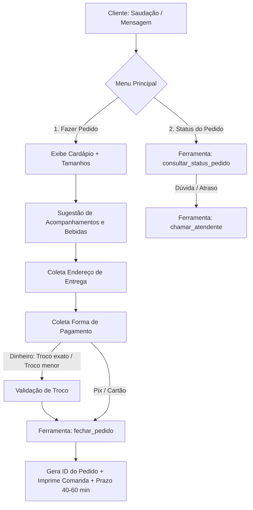

# 🍽️ Agente de Atendimento WhatsApp — Restaurante Família Ricardo

> Agente de Inteligência Artificial para atendimento automatizado, realização de pedidos delivery, consulta de status e impressão de comandas no WhatsApp via Meta Cloud API.

---

## 📌 Visão Geral

Este projeto implementa um atendente virtual inteligente para o **Restaurante Família Ricardo** (Caraguatatuba/SP). Construído em **Node.js nativo (sem dependências externas)**, o agente integra-se diretamente à **Meta Cloud API (WhatsApp)** e utiliza modelos de linguagem de ponta via **OpenRouter** (`google/gemini-3.7-flash`), suportando *function calling* para processamento transacional de pedidos.

---

## 🚀 Principais Funcionalidades

- 📋 **Cardápio Interativo:** Apresentação dinâmica de pratos diários, pratos do dia (ex: Feijoada), porções, adicionais e bebidas.
- 🛍️ **Fluxo Completo de Delivery:**
  - Escolha de pratos e tamanhos (Infantil, Médio, Grande).
  - Sugestão inteligente de adicionais e bebidas.
  - Coleta detalhada de endereço (Rua, Número, Bairro, Ponto de Referência).
  - Validação de regras de pagamento e troco (troco exato / troco incorreto).
- 🧾 **Geração e Impressão de Comanda:** Formatação e despacho de comanda padronizada para impressora térmica da cozinha (`pedidos.js`).
- 🔍 **Consulta de Status de Pedido:** Consulta em tempo real do andamento por ID ou telefone do cliente.
- 🙋 **Transbordo Humano (`chamar_atendente`):** Alerta e direcionamento imediato para atendimento humano em caso de dúvidas complexas ou atrasos.
- 🛡️ **Segurança e Resiliência:**
  - Validação criptográfica de webhooks via HMAC-SHA256 (`x-hub-signature-256`).
  - Deduplicação de mensagens recebidas.
  - Fila de atendimento por número de telefone para evitar condições de corrida (concorrência).
  - Janela de memória de 24h e limite de mensagens contextuais.

---

## 📐 Fluxo de Atendimento



---

## 🛠️ Stack Tecnológica

- **Runtime:** Node.js `>= 20.6` (suporte a `--env-file` e ESM nativo).
- **Dependências:** `0` (Zero dependências `npm`, utiliza apenas APIs nativas do Node.js: `crypto`, `http`, `fs`, `readline`).
- **LLM / IA:** Google Gemini 3.7 Flash via OpenRouter API.
- **Canal:** Meta WhatsApp Business Cloud API.

---

## 🗂️ Estrutura do Projeto

```text
├── .agents/             # Regras de arquitetura e perfis de engenharia
├── .env.exemplo         # Modelo de variáveis de ambiente
├── .gitignore           # Ignora credenciais, logs e arquivos de runtime
├── AGENTS.md            # Diretrizes globais para desenvolvimento com agentes
├── ANDAMENTO.md         # Memória contínua e contexto consolidado do projeto
├── LEIA-ME.md           # Resumo rápido de execução
├── README.md            # Documentação completa do projeto
├── agenda.js            # Integração com agenda (ou agenda de demonstração)
├── agente.js            # Servidor HTTP / Webhook para Meta Cloud API
├── cerebro.js           # Orquestrador da IA, memória, regras e ferramentas
├── negocio.md           # Ficha do restaurante: cardápio, horários e regras
├── package.json         # Manifesto e scripts de execução
├── pedidos.js           # Gerenciamento de pedidos e impressão térmica
├── simular.js           # CLI interativo para testes de atendimento no terminal
└── testar.js            # Bateria automatizada de testes de fluxo e segurança
```

---

## ⚙️ Pré-requisitos e Configuração

### 1. Pré-requisitos
- **Node.js** 20.6 ou superior instalado.

### 2. Configurar Variáveis de Ambiente
Copie o arquivo [.env.exemplo](file:///c:/@PROJETOS/APP/restaurante-ricardo-whatsapp/.env.exemplo) para criar o seu `.env`:

```bash
cp .env.exemplo .env
```

Preencha as chaves no `.env`:
- `OPENROUTER_API_KEY`: Chave da API OpenRouter (necessária para simulação e produção).
- `MODELO`: Modelo de IA utilizado (Padrão: `google/gemini-3.7-flash`).
- `WHATSAPP_TOKEN`, `WHATSAPP_PHONE_NUMBER_ID`, `WHATSAPP_VERIFY_TOKEN`, `WHATSAPP_APP_SECRET`: Credenciais do Meta for Developers (necessárias para execução em produção).

---

## 💻 Como Executar

### 1. Simulação Interativa no Terminal
Converse diretamente com o agente no console, sem necessidade de configurar o WhatsApp:
```bash
npm run simular
```

### 2. Bateria de Testes Automatizados
Valida regras de negócio, cálculos de troco, ferramentas e segurança:
```bash
npm run testar
```

### 3. Servidor de Produção (Webhook WhatsApp)
Inicia o servidor HTTP nativo na porta configurada (padrão: `3000`):
```bash
npm start
```

---

## 📞 Informações do Estabelecimento

- **Restaurante:** Restaurante Família Ricardo (desde 2018)
- **Localização:** Av. Irineu Mendes de Souza, 1531, Martim de Sá — Caraguatatuba/SP
- **Horário:** Segunda a Sábado, das 11:00 às 14:30 (Fechado aos Domingos)
- **Contato:** (12) 99750-0045 / (12) 98146-4976
